<table style="width: 100%; border-collapse: collapse; text-align: center;">
  <tr>
    <td style="border: 4px solid #000; background-color: #f0f0f0; display: flex; justify-content: center; align-items: center; height: 100px;">
      <h1><strong>  Welcome to HandleOS</strong></h1>
    </td>
  </tr>
  <tr>
    <td style="border: 2px solid #000;">
      
    </td>
  </tr>
</table>

<a href="README.md" style="color: #2079C8;">Introduction</a> | <a href="installation_guide.md" style="color: #2079C8;">Download + Installation Guide</a> | <a href="features.md" style="color: #2079C8;">Features</a> | <a href="https://github.com/Special-Niewbie/HandleOS/discussions" style="color: #2079C8;">Discussions</a> | <a href="BugFix_and_NewFeatures.md" style="color: #2079C8;">Bug Fix & New Features Scheduling</a> | <a href="BCDFix.md" style="color: #2079C8;">Guide to Restoring BCD</a> | <a href="TP.md" style="color: #2079C8;">Tweak Paradise</a> | <a href="PrivacyPolicy.md" style="color: #2079C8;">Policy Privacy</a>

  

    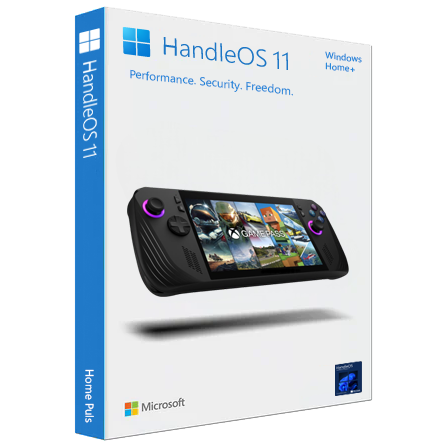
    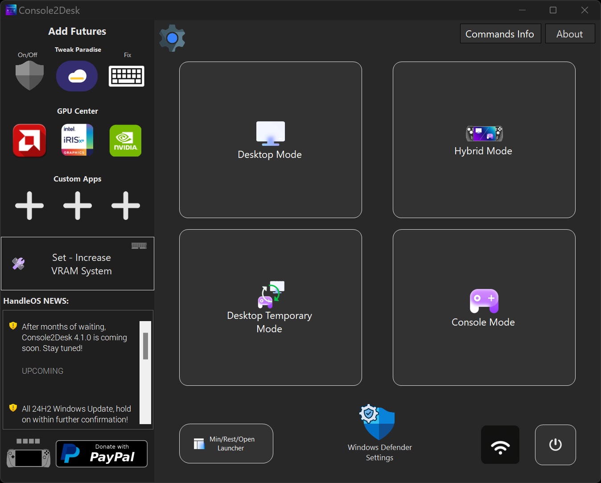

          

# 🚧 Page Under Maintenance 🚧

**The page is currently being updating to explain the new C2D version 4.1.0 and improve several sections. Please check back in the next few hours/Days for detailed information!**

## Join Our Discord Community!

In Discord channel where we can exchange ideas, provide support, and help each other out at:

**HandleOS** is a fan-made project tailored for those seeking a lightweight, secure, privacy-focused, reversible features and stable OS, ideal for future handheld PCs and more. Based on Windows 11 official ISO (so from Microsoft's official site), a valid Microsoft license is required from your Microsoft device; HandleOS is optimized by removing telemetry, unnecessary software,  services, while retaining all Windows Defender security features. This reduces RAM consumption to use approximately 1 GB in "IDLE Benchmark" (on a virtual machine), allowing more RAM to be allocated to the APU GPU and improving responsiveness.

After months of rigorous development, HandleOS now introduces a major milestone called **Console2Desk** tool. From C2D 4.1.0 version represents a complete overhaul of my previous work, featuring numerous improvements and exclusive new functionalities, including the ground breaking `Hybrid Mod`.

**What’s New from Console2Desk 4.1.0?**

First, I would like to remind you that you can recall **Console2Desk** from anywhere by using the following shortcuts:
- **Keyboard**
    - `CTRL+SHIFT+F7` = Opens Console2Desk
    - `CTRL+SHIFT+F5` = Default call to open **HandleOS TabView**
    
- **Controller/Gamepad**
    - `SELECT+START` = Opens Console2Desk (with a small vibration)
    - `SELECT+LB+RB` = Default call to open **HandleOS TabView**. You can change this setting through the menu in the System Tray. Please refer to the documentation in the <a href="features.md"  style="color: #2079C8;">Features</a> section.

*`Hybrid Mode:`*
Hybrid Mode is an evolution of the other simpler function called `Console Mode`. It bridges the gap between desktop apps and UWP apps, enabling seamless integration of both environments. Previously, this level of compatibility was impossible in `Console Mode` that operate to cutting off many Windows services (without UI). With *Hybrid Mode*, you can fully customize your handheld or PC, offering unprecedented flexibility and control.

*`Only in Hybrid Mode we have Custom Context Menu:`*
A brand-new, custom-designed Context Menu, has been implemented specifically for handheld devices. In *Hybrid Mode*, this menu replaces the default Windows Context Menu, offering an optimized experience for touch screen. Achieving this required advanced coding techniques to ensure smooth functionality.

**Enhanced UI and Performance:**

*Revamped User Interface (UI):* The Console2Desk UI has been reimagined from the latest 3.8.9/ 3.9.0 version, now featuring animated effects that improve user interaction.
Faster Mode Switching: Performance has been doubled when transitioning between modes, ensuring a seamless and responsive experience.
*Customizable Program Shortcuts:* Added three new customizable "icon boxes" where you can easily pin your favorite applications.

*Improved `TabView` and More:*
The TabView has been rewrite with low level language, alongside various under-the-hood enhancements that lay the foundation for even more ambitious features in the future.

*A Licensing Model*
Given the extensive work behind this major update, starting with version 4.0.0, `Console2Desk` is available to those who invest in or donate to the project (all the previous deprecated versions still available). Here’s how the licensing works from 4.0.0:

## Licensing and Donations  

To support the development of `HandleOS`, you can obtain a license by donating:  
- **Standard License**: Donate a minimum of **€4.99**.  
- **Premium License**: Donate **€19.99 or more** to become a Premium Donor.  

Both licenses currently offer the same features, but in future updates, they will differ in terms of themes and multi-language support. By donating, you are supporting the project, not purchasing a license.  

If you would like to support the ongoing development with any amount time to time, you are welcome to make a donation in any amount. Please note that maintaining this  project incurs some monthly costs from my side.

<small> `Please note`: Any donation amount below €4.99 will be considered a simple donation to support the project and will not include any license as a gift. </small>  

### How to Donate  
You can make your donation using the buttons below, either directly on this page or through the HandleOS app installed:  

***PayPal***

  

- **Donate minimum €4.99**: [Click here](https://www.paypal.com/ncp/payment/L9G5UEVC6CRTU)  

- **Donate minimum €19.99**: [Click here](https://www.paypal.com/ncp/payment/NBCZWN8AA54FA)  

- **Donate Any Amount**: [Click here](https://www.paypal.com/paypalme/CrisDonate/)  

The license will be processed and then sent to your email as a gift within **3 to 48 hours**, depending on the system’s processing time (<small>please check your spam folder as well if you haven't received an email from me regarding your license, before contacting me :blush:</small>).  

My goal is to create a community of enthusiasts eager to get the most out of these products, considering that both Linux and Windows have their Pros and Cons.

You can find installation instructions and the ISO here below, or by selecting the tab above:

<a href="installation_guide.md" style="color: #2079C8;">Download + Installation Guide</a> 

 

:book: ​For Tweaks and Features Guides you can click here <a href="TP.md" style="color: #2079C8;">Tweak Paradise</a> or here <a href="features.md" style="color: #2079C8;">Features</a> .

  

⚠️***Only for Steam Deck Users follow this:*** please, take a look at this <a href="steam_deck_guide.md" style="color: #2079C8;">Steam Deck Guide</a> created (and thanks) by @AllevatoreAnonimo. <u>Valve hasn't optimized the Steam Deck drivers for Windows</u> (***seems to be on purpose!***), which cause some challenges for users trying to make the switch from SteamOS to Windows. This guide, can help you navigate the process / troubleshooting and avoid some of the frustration that comes with using Windows on Steam Deck. But I hope you are not discouraged because you have a Steam Deck that does not perform to its full potential without the right drivers, so you are aware of this.

    

## *Minimum* System Requirements (*base on my testing*)
| 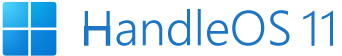        |                           Specs                            |
| ------------------------------------------------------------ | :--------------------------------------------------------: |
| 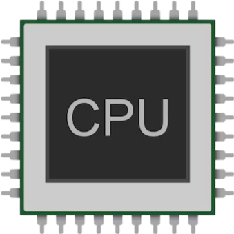  **CPU**           |          Intel Atom N550 / 1.5 GHz ( Dual-Core )           |
|   **RAM**           |                     1.5 GB DDR3 SDRAM                      |
| 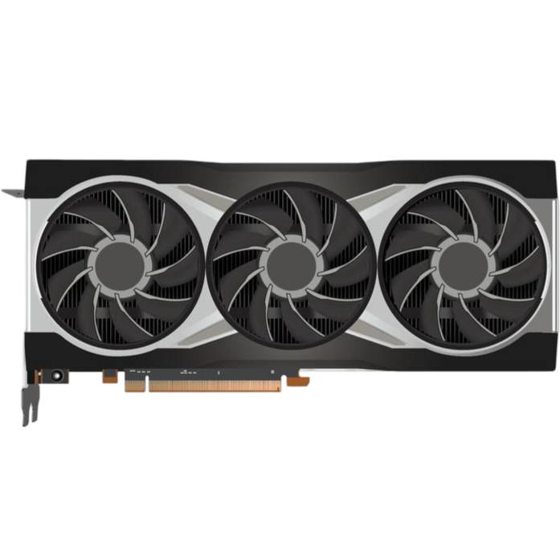  **GPU**           | Any (with drivers compatible or modded for modern OS) |
|   **HDD/SSD**   |                 15 GB  (Tested by VM)                 |
| ↺  *Hybrid Mode/ Console Mode / Desktop Mode* |                             ✅                              |
|   **TPM**  |                     |

**NOTE**: *The benchmark and RAM consumption of approximately 1 GB, is based on a system with limited hardware characteristics. This value is intended to reflect the OS's lightness. HandleOS, by nature of being based on Windows, may use slightly more RAM if you have a large amount available on your PC, especially if there are default drivers that Windows has founded in its local database. Conversely, if the system has very limited specifications, HandleOS will adjust and use less RAM accordingly.*

| Feature                                                      |   HandleOS 11   |
| ------------------------------------------------------------ | :-------------: |
| 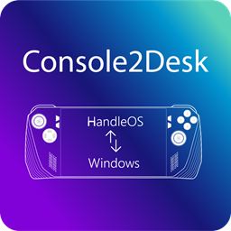   Console2Desk |        ✅        |
|   HandleOS Personalized Wallpapers |        ✅        |
|  or     The default user interface is set to either Heroic or Playnite for both Hybrid and Console Modes. However, you can change this setting and use any other UI or software via the Console2Desk settings. |        ✅        |
|   Microsoft Edge + 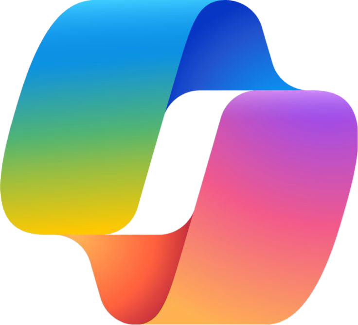Copilot (*suggestion, avoid installing both due to potential privacy concerns and the significant increase in Microsoft background services*) | ✅ (Installable) |
|  Microsoft Store | ✅ (Installable) |
|   OS Debloated and Optimized (*all the functions can be reversible by Console2Desk*) |        ✅        |
| 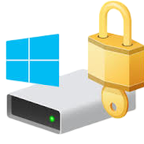  Device Encryption |        ✅        |
| 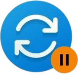  Full Upgradable (*by default are suspended to reduce services in background  if reactivate remember to suspend again by Console2Desk*) |        ✅        |
|   Windows Defender (*are disabled some useless component, and can be reactivated by Tweak Paradise from Console2Desk*) |        ✅        |
| 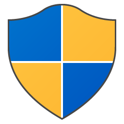  UAC (*is disabled by default starting from `HandleOS 3.1`, to allow navigation to any OS folders/settings using an Xbox Controller or similar devices. However, to increase the security, it can be reactivated through Tweak Paradise in Console2Desk*) |        ✅        |
| 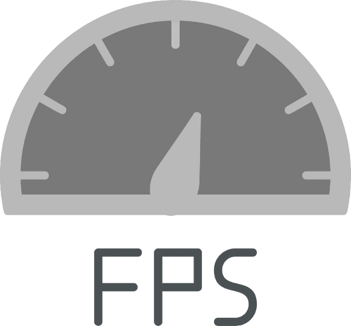 Lightweight OS = FPS Boost |        ✅        |

### Benchmark (based on RAM 2GB / CPU 2 Core 4 Threads)

    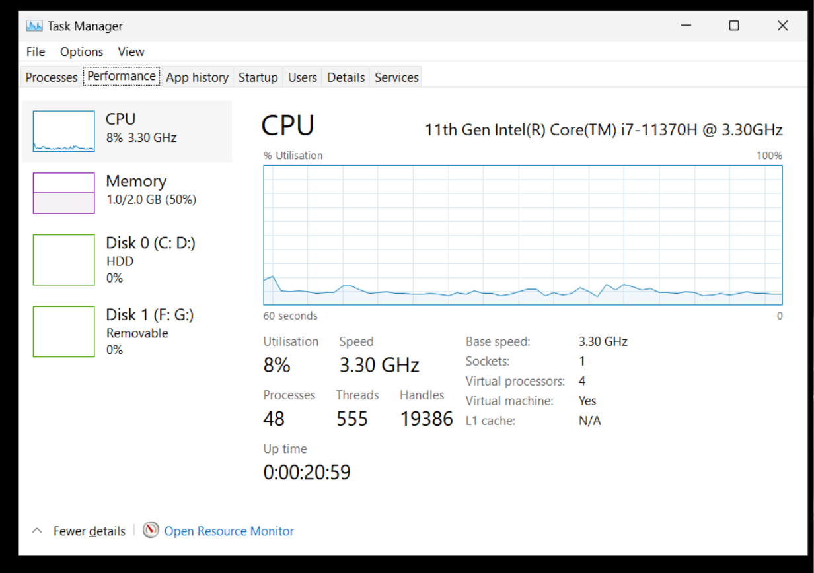
    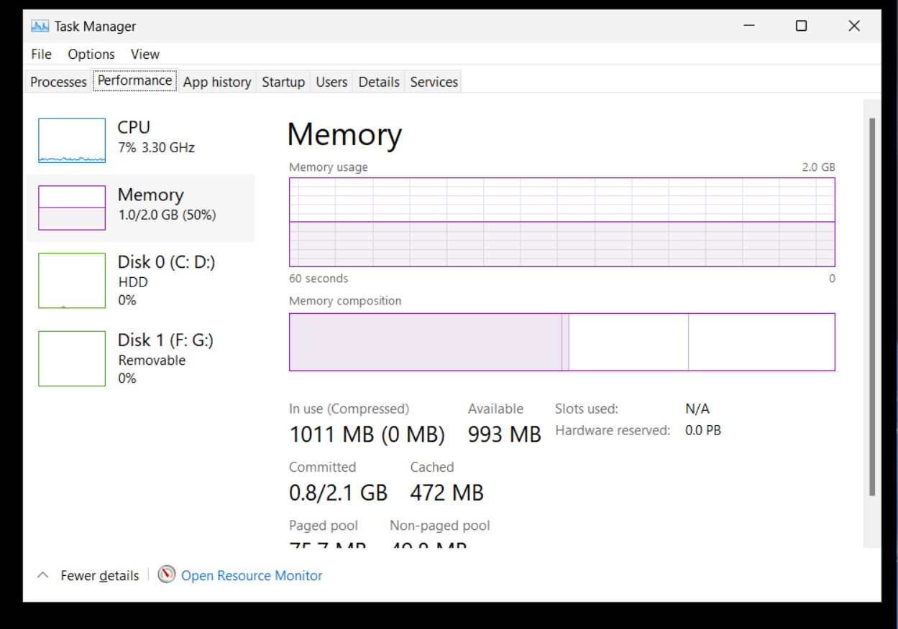

    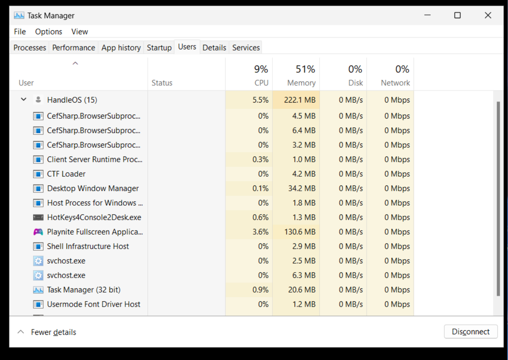

### HandleOS TabView from v4.1.0 – Rewritten from scratch in C

In response to user feedback, I have completely rewritten the code for **HandleOS TabView** from scratch in **C**, starting with **version 4.1.0**.  
This update allows for more reliable interaction with the operating system and introduces new effects in it.
You can now invoke **HandleOS TabView** not only with a controller by using ***BACK***+***LB***+***RB*** (*remember you can change this controllers combination buttons, please read for more details in <a href="features.md" style="color: #2079C8;">Features</a> section*) but also via keyboard using the shortcut **CTRL+SHIFT+F5** and moving with **Left** and **Right Arrows**, to select the Background app press **ENTER**  .  

- It provides **two modes** for interacting with your Background applications:  

  - **Informational View**:  
    Shows a preview of the windows you're switching in between and will automatically close after about **five seconds** if no selection is made.  

  - **Interactive View**:  
    Navigate through apps using the **D-Pad** **Left** or **Right** Arrows on your controller to move between applications and press **A** to select an app.  

In addition to these improvements, you can still utilize **multitasking features** to switch between apps when running a scaling application alongside your game.  
This **dual functionality** streamlines the process of managing multiple windows efficiently.

    

## License

This project includes both open source and proprietary components:

- The Open and Close source components are licensed under the MIT License (see `LICENSE`).
- The proprietary components are subject to copyright and are licensed separately (see `COPYRIGHT`).

## YouTubers Video 

1. Italian Language

    
    
    
    
    

## Credits

- Special thanks to the Italian YouTuber   [Prob]( https://www.youtube.com/@Prob-nest/featured) , for trusting and having been a dedicated beta tester on pre-release of *HandleOS*.
- Special thanks to developer @AderitoSilva for his amazing `XInputium drivers` 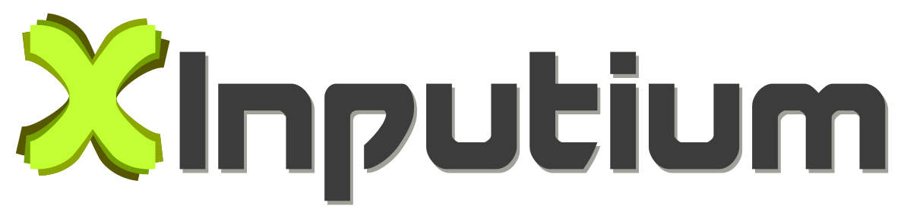 and support—without him, it wouldn’t have been possible!

### Contributors

  

### Others

- A special thanks to my trusty test subject, the Rog Ally and one of my very old pc Samsung NF210, and all the SSDs that bravely endured my endless experiments.

[Back to top](README.md)
