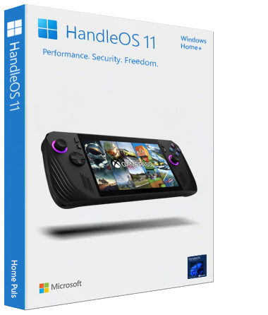

  <h1><strong>Welcome to HandleOS</strong></h1>

  
    

<a href="README.md" style="color: #2079C8;">

Introduction</a> | <a href="installation_guide.md" style="color: #2079C8;">Download + Installation Guide</a> | <a href="#features" style="color: #2079C8;">Features</a> | <a href="#contact" style="color: #2079C8;">Contact</a>

  
    

    

HandleOS is a fan-made project dedicated to those seeking a lightweight, secure, privacy-focused, and stable operating system, ideal for future Handled PCs. Based on the original Windows 11 from Microsoft site (a valid license must be from your Microsoft device), HandleOS has been optimized by removing telemetry, default software, and unnecessary services while retaining almost all Windows Defender security features. This reduces RAM consumption to around 1 GB in "IDLE Benchmark" on a virtual machine, which is particularly advantageous for allocating more RAM to the APU GPU and increasing responsiveness.

After months of rigorous testing, I have significantly improved HandleOS performance, increasing FPS, enhancing stability, and reducing power consumption. If you're concerned about safety, rest assured: there is no unusual software or content present, only my completely open-source tools and optimizations aimed at optimizing resources for gaming. This is the result of my passion!

HandleOS aspires to become a benchmark in the world of gaming performance. I actively invite the community to participate by sharing ideas and improvements by clicking on the Discussions & Tips tab above. One of the unique features of HandleOS is the ability to easily switch between Handled/Console Mode and Desktop Mode.

My goal is to create a community of enthusiasts eager to get the most out of these products, considering that both Linux and Windows have their Pros and Cons. If you appreciate my work and have the means, I would be grateful if you could contribute to this project or contribute with a small donation to support me in continuing to develop.

[Back to top](#handleos)

## *Minimum* System Requirements (*base on my testing*)
|         |                           Specs                            |
| ------------------------------------------------------------ | :--------------------------------------------------------: |
|   **CPU**           |          Intel Atom N550 / 1.5 GHz ( Dual-Core )           |
|   **RAM**           |                     1.5 GB DDR3 SDRAM                      |
|   **GPU**           | Any (with drivers compatible or modded for modern OS) |
|   **HDD/SSD**   |                 15 GB  (Tested by VM)                 |
| ↺ Console Mode / Desktop Mode |                             ✅                              |
|   **TPM**  |                     |

**NOTE**: The benchmark and RAM consumption of approximately 1 GB, is based on a system with limited hardware characteristics. This value is intended to reflect the OS's lightness. HandleOS, by nature of being based on Windows, may use slightly more RAM if you have a large amount available on your PC, especially if there are default drivers that Windows has founded in its local database. Conversely, if the system has very limited specifications, HandleOS will adjust and use less RAM accordingly.

| Feature                                                      |   HandleOS 11   |
| ------------------------------------------------------------ | :-------------: |
|    Console2Desk |        ✅        |
|   HandleOS Personalized Wallpapers |        ✅        |
|  Default UI Playnite, used for Console Mode (can be changed and use others UI by Console2Desk) |        ✅        |
|   Microsoft Edge + Copilot | ✅ (Installable) |
|  Microsoft Store | ✅ (Installable) |
|   OS Debloated |        ✅        |
|   Device Encryption |        ✅        |
|   Full Upgradable (by default it's suspended to reduce services in background) |        ✅        |
|   Windows Defender (just `Core isolation` and `Cloud-submissions` are disabled) |        ✅        |
|  Lightweight OS = FPS Boost |        ✅        |

[Back to top](#handleos)

## Credits
Special thanks to the YouTuber **Prob** (Italy), for being a dedicated beta tester and for suggesting valuable ideas.

[Back to top](#handleos)
