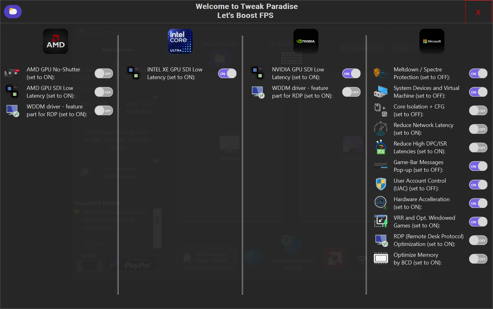

<a href="README.md" style="color: #2079C8;">Introduction</a> | <a href="installation_guide.md" style="color: #2079C8;">Download + Installation Guide</a> | <a href="features.md" style="color: #2079C8;">Features</a> | <a href="https://github.com/Special-Niewbie/HandleOS/discussions" style="color: #2079C8;">Discussions</a> | <a href="BugFix_and_NewFeatures.md" style="color: #2079C8;">Bug Fix & New Features Scheduling</a> | <a href="BCDFix.md" style="color: #2079C8;">Guide to Restoring BCD</a> | <a href="TB.md" style="color: #2079C8;">Tweak Paradise</a>


<div style="text-align: center;">
  <h2><strong>Tweak Paradise</strong></h2>
  <h3><strong>Let's Boost the FPS</strong></h3>
</div>
<div align="center">  
    
</div>


**vers. 3.8.0*


## AMD

1. **AMD GPU No-Shutter** (set to ON):

   By default, this option is set to OFF and should only be enabled after you have installed all your drivers. The AMD GPU No-Shutter function is compatible exclusively with AMD GPUs and APUs. When activated, it  eliminates in-game stuttering by improving the responsiveness of your GPU.

   This feature disables the Ultra Low Power State (ULPS) on AMD GPUs, which typically puts the GPU to sleep when not in use (or in meantime you are using it but not in full power). Frequent switching between active and sleep states can cause stuttering during gaming or streaming. Disabling ULPS keeps the GPU consistently active (work normally), reducing stuttering and improving performance, especially when the GPU isn't fully utilized. This is particularly beneficial for gaming and streaming with low demanding GPU, where a consistent GPU performance and low consumptions are crucial.

2. **AMD GPU SDI Low Latency** (set to ON):

   Signal-Driven Interrupts (SDI) optimize communication between the GPU and CPU by reducing interrupt latency, improving response time, and boosting performance in demanding tasks, especially when handling multiple interrupts. 

3. **WDDM Driver Switch – feature part for RDP** (set to ON): 
   Optimizations for using XDDM drivers on Nvidia cards. It can also be used on AMD cards but may not be beneficial for certain configurations. Activate it only if you are sure it will improve your Remote setup. 


## Intel

1. **INTEL XE GPU SDI Low Latency** (set to ON):

   Signal-Driven Interrupts (SDI) optimize communication between the GPU and CPU by reducing interrupt latency, improving response time, and boosting performance in demanding tasks, especially when handling multiple interrupts.
   


## Nvidia

1. **NVIDIA GPU SDI Low Latency** (set to ON):

   Signal-Driven Interrupts (SDI) optimize communication between the GPU and CPU by reducing interrupt latency, improving response time, and boosting performance in demanding tasks, especially when handling multiple interrupts.

2. **WDDM Driver Switch – feature part for RDP** (set to ON): 
   Optimizations for using XDDM drivers on Nvidia cards. Activate it only if you are sure it will improve your Remote setup. 


## Microsoft

1. **Meltdown / Spectre Protection** (set to OFF):
   In early 2018, the PC industry was significantly impacted by the discovery that certain processor design features, used to enhance the performance of modern PCs, could be exploited to create severe security vulnerabilities known as Meltdown and Spectre. The industry has been actively addressing these threats through updates to operating systems, motherboard BIOSes, and CPU firmware. 
   ***What are Meltdown and Spectre Protection:*** 
   
   - ***Meltdown**:* This vulnerability affects the ability of processors to protect kernel memory. Many modern processors, particularly those from Intel, have received patches that mitigate this issue.
   - ***Spectre**:* This vulnerability involves speculative execution and affects both Intel and AMD processors. Protection from Spectre may result in a reduction in system performance. When the protection is enabled, it can lead to a decrease in performance due to the additional overhead of these security measures.  
   - ***For Intel CPUs:*** 
     If you are using an older Intel CPU and do not install potentially unsafe software, keeping this protection turned OFF can result in a significant boost in FPS, particularly noticeable in older Intel architectures. If you have a modern Intel CPU, and install software whose safety you cannot guarantee, it is advisable to turn this protection ON to safeguard your PC and data. 
   - ***For AMD CPUs:***  
     AMD CPUs are inherently immune to Meltdown attacks but may be vulnerable to some variants of Spectre. This means you can generally leave this protection OFF with less risk compared to Intel CPUs. However, if you frequently install unknown or suspicious software, it is safer to keep this protection ON. - It is recommended to run benchmarks to evaluate the impact of enabling or disabling this protection on FPS and system responsiveness. 
   - ***Additional Tips:*** 
     You can toggle this function ON or OFF temporarily if you notice performance differences in specific games or applications, especially AAA titles. - To ensure that changes take effect, it is best to restart your PC after making modifications to this setting.
   
2. **Some System Devices for Virtual Machine** (set to OFF): 
       This switch should be turned OFF only after you have completed the initial installation of all drivers on your PC, and on each ON/ OFF must to restart the Computer . 

   ##### *Here’s how to use this setting:* 
```
- After Initial Driver Installation: 
Once you have installed all necessary drivers for your hardware, you can consider turning this switch OFF. This setting is intended to improve system performance by disabling certain system devices that are used primarily for virtual machines.

- Virtual Machines and Custom Drivers: 
If you are not using virtual machines on your Handheld/PC and do not install custom drivers for any connected hardware, or if you are not installing drivers from unknown or untrusted sources, it is generally safe to disable this switch. Disabling it can lead to improved system performance, including more stable FPS and better responsiveness, especially on systems with limited power like Handhelds.

- When to Keep ON: 
If you are using virtual machines, or if you are installing custom or unknown drivers, it is advisable to keep this switch ON to ensure system stability and compatibility. By turning this switch OFF, you may experience performance improvements such as more stable FPS and increased responsiveness, particularly beneficial for systems with limited resources. However, ensure that you have completed all necessary driver installations and are not using virtual machines before making this change.
```


3. **Core Isolation + CFG** (set to OFF):
     - **What is Core Isolation Memory Integrity?**    
         Core isolation provides enhanced protection against malware and other attacks by isolating critical system processes from the operating system and device. Memory integrity, a feature of core isolation, helps prevent malicious code from interfering with high-security processes. By enabling Memory Integrity, you add an additional layer of defense to protect your system from potential attacks. 
     - **What is Control Flow Guard (CFG)?**    
         Control Flow Guard (CFG) is a security feature designed to protect against memory corruption vulnerabilities. It achieves this by enforcing strict restrictions on where an application can execute code from, making it much harder for exploits to execute arbitrary code through vulnerabilities like buffer overflows. CFG builds on previous exploit mitigation technologies such as /GS (Buffer Security Check), DEP (Data Execution Prevention), and ASLR (Address Space Layout Randomization).
     - **Benefits of Core Isolation and CFG:**  
         - Prevent memory corruption and ransomware attacks by isolating critical system processes.
         - Restrict server capabilities to minimize the attack surface and reduce the risk of exploitation.  
         - Make it more difficult for attackers to exploit vulnerabilities and execute arbitrary code. 
     - **Explanation**   
         By default, Core Isolation and CFG are set to OFF to optimize performance, especially on systems with limited resources. Enabling these features provides additional security but may impact system performance. So for majority of the situation it's safe to keep turning OFF, consider enabling them if you require enhanced protection against potential threats and are willing to trade off some performance for increased security.
4. **Reduce Network Latency** (set to ON) :
         The `Reduce Network Latency` option is designed to optimize your network performance by adjusting the handling of network packets for online competitive Games. Here’s a brief overview of how it works and when to use it:
           
     *Recommendations*:
         - **For Low Latency Connections:** If you prioritize low latency and need immediate responsiveness (e.g., for online gaming or real-time applications), it is advisable to turn off Nagle's Algorithm. This allows the sender to send packets of any size immediately, reducing delays caused by buffering.
             - **For High Bandwidth Large Transfers:** If your primary use involves high-bandwidth connections with large data transfers (e.g., file downloads or streaming), enabling Nagle's Algorithm can be beneficial. It helps optimize the use of network bandwidth by minimizing the number of packets sent, which can improve overall transfer efficiency.


​      

  :information_source:***Important Note***: *This switch applies the `Reduce Network Latency` setting, only to the currently connected network and IP address. If you change your IP address or switch to a different network, you will need to re-enable the switch to apply the setting to the new network or IP.*

*By adjusting this setting, you can better tailor your network performance to match your specific needs, whether you require low latency for interactive applications or optimized bandwidth for large data transfers.*


5. **Reduce High DPC/ISR Latencies** (set to ON):
    This setting activates a Windows tweak package that is not included by default in the operating system. It helps to mitigate issues related to high DPC (Deferred Procedure Call) and ISR (Interrupt Service Routine) latencies. 

6. **Game-Bar Messages Pop-up** (set to OFF):

    If you're not using the Microsoft Store or GameBar (which is disabled by default in HandleOS but can be reinstalled), you may still see pop-up prompts to open GameBar when launching games. Disabling this setting is intended to stop Windows from making these requests. 
     -*This feature is still under testing, so if it doesn't work as expected, please report it.*

7. **UAC** (set to OFF): 
    *User Account Control* , it open programs in administrator mode without pop-up (*warnings, use it cautiously*).
    You can use when you are offline, as some game can performs better with full access to memory RAM or when you need to Navigate/ Open different Windows apps by an external controller; to don't let the UAC to stop the mouse function when it pops-up the warning, as when the UAC it's ON. 

8. **Hardware Acceleration** (set to ON):
    This setting enables Windows to offload specific tasks, such as graphics rendering and video decoding, move to dedicated hardware components like the GPU, instead of relying solely on the CPU. 

9. **VRR and Windows Games Optimization** (set to ON):

    - *Widows Variable refresh rate:* When possible, get a higher frame rate and reduce screen tearing in
      games that don't support variable refresh rate by default. You might
      need to restart your game for this to take effect.
    - *Optimisations for windowed games:* Reduce latency and use advanced features in compatible games by using flip presentation model. You'll need to restart your game for changes to take effect.

10. **RDP (Remote Desktop Protocol) Optimization** (set to ON):
    It's group of optimisations, that allows you to play games or use remote connections in RDP with full power and low latency.

11. **Optimize Memory and Reduce Stutter by BCD** (set to ON):
         This setting is designed to optimize memory performance and reduce stuttering by modifying the Boot Configuration Data (BCD). To use this feature effectively, `Secure Boot` must be completely disabled in the BIOS. If Secure Boot is enabled, this optimization will not function as intended.  

       - **How It Works:** 
         - ***i.*** The optimization avoids the use of non-contiguous portions of low-memory from the operating system. This boosts memory performance and can improve micro-stuttering in about 80% of cases.
           - ***ii.*** It also addresses command buffer stutter, particularly after disabling 5-level paging on 10th generation Intel processors. 
             Note: that this optimization can cause system instability or freezes if the memory sticks are unstable.
           - ***Reverting to Standard Settings:***   
             If you encounter issues with USB devices that are functional but corrupted, or if you wish to return to default system settings, you can turn the switch to OFF and re-enable `Secure Boot` in the BIOS. This will revert the system to its standard configuration and should resolve any related issues.
             
