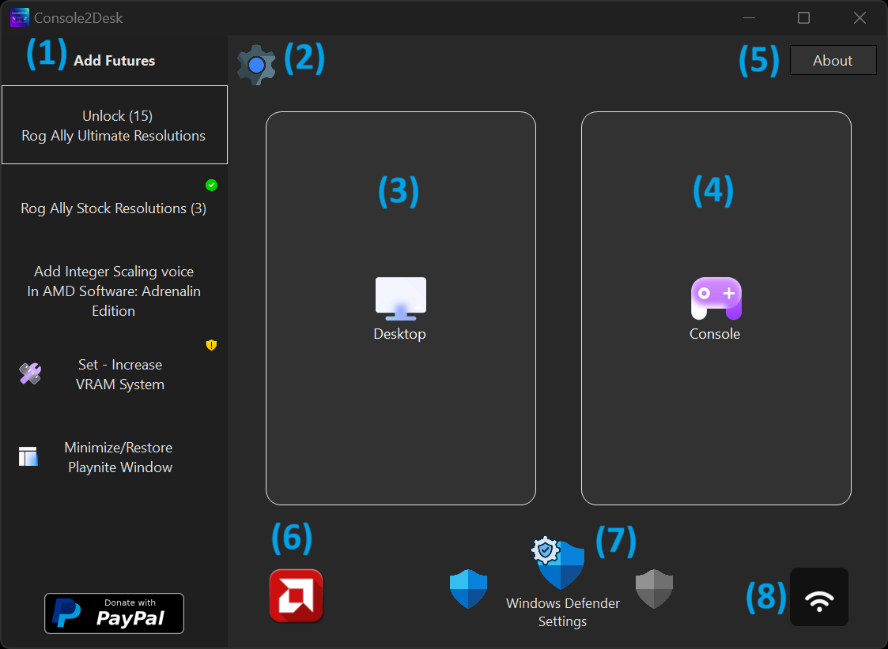
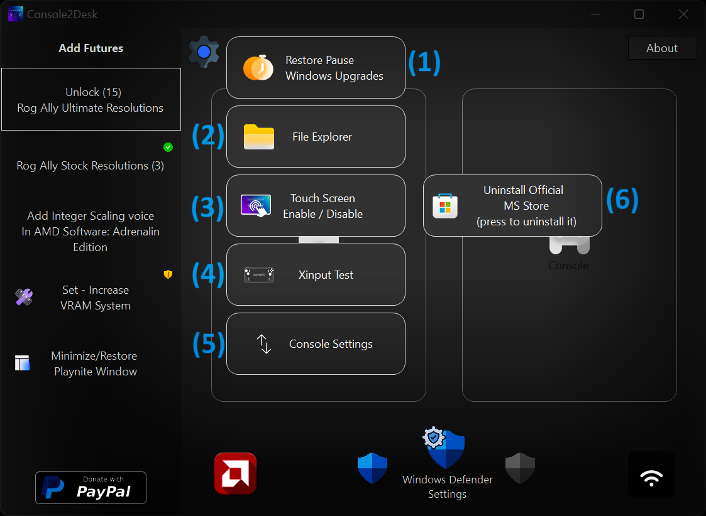
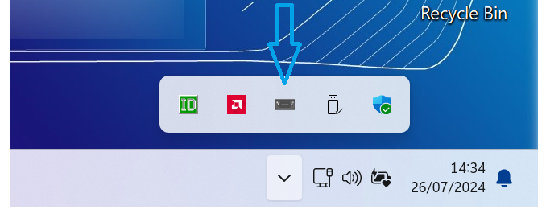
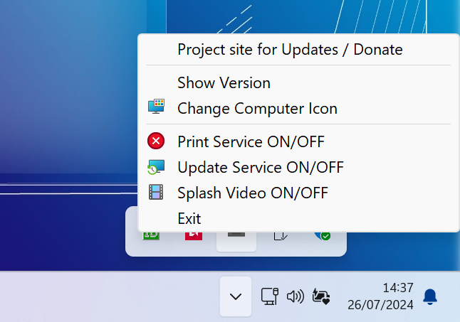

<a href="README.md" style="color: #2079C8;">Introduction</a> | <a href="installation_guide.md" style="color: #2079C8;">Download + Installation Guide</a> | <a href="features.md" style="color: #2079C8;">Features</a> | <a href="https://github.com/Special-Niewbie/HandleOS/discussions" style="color: #2079C8;">Discussions</a> | <a href="BufFix_and_NewFeatures.md" style="color: #2079C8;">Bug Fix & New Features Scheduling</a>

## Features

### Overview

HandleOS is not just a fast operating system, optimized with debloating techniques or designed with unique wallpapers and icons to stand out from other projects. HandleOS aims to develop open-source tools to enhance the user experience on handheld consoles/PCs, and it is also suitable for tablets or traditional PCs. Our goal is to continue advancing the development of handheld computing, making HandleOS a benchmark in the market. While Microsoft focuses on adding AI features and bloated functionalities to their OS, neglecting this important segment for enthusiasts, HandleOS steps in to fill that gap.

This is where `Console2Desk` and its companion `HotKeys4Console2Desk` come into play. In this section, I will outline what we have in the first version. Additional features and future improvements will be detailed in their respective sections.

  <h3><strong>Console2Desk</strong></h3>

  
    

### 1. Add Features

- **Unlock (15) Rog Ally Ultimate Resolutions**: This function, initially designed only for the Rog Ally 16:9 screen, increases the base screen resolutions from 3 to a total of 15. This is advantageous for adapting screen resolutions to different scenarios, especially for old Arcade or PC games that were designed for lower resolutions and would not run on newer systems with high default resolutions.

- **Rog Ally Stock Resolutions (3)**: This function restores the Stock screen functions in case, for some reason, you want fewer available resolutions.

- **Add Integer Scaling voice in AMD Software: Adrenalin Edition**: This button is only for AMD APUs. It adds Integer Scaling, which is not implemented in Handhelds for some reason. This is particularly suitable for those with a handheld with a 2k (or higher) screen or those who connect the handheld to a PC monitor. This function is a "must-have" because it allows you to play natively at half resolution without degrading the image, thus increasing in-game performance.

- **Set - Increase VRAM System**: Although this section shows a yellow triangle, it is suitable for most hardware by default. I have set the virtual RAM, also known as `SWAP`, for operating systems with limited RAM of 8GB, increasing the system's available RAM to three times the installed amount. For example, with 8GB of RAM, the system will have 24GB available, using the NVME as RAM. Don't worry about the NVME lifespan because you can't imagine how much Stock Windows constantly writes files in the background, so everything we adjusted compensates for this.

- **Minimize/Restore Playnite Window**: As the name suggests, this is useful if you need to force Playnite into the background for some reason. You can use Console2Desk temporarily to keep and minimize Playnite in the background.

- **PayPal**: As you might guess, this is the donation section where you can donate directly to me and support the HandleOS project if you enjoyed it.

### 2. Settings Menu
Button to open the Settings Menu, which will be discussed later.

### 3. Desktop Mode
Touch button `Desktop Mode` to switch from `Console Mode` to `Desktop Mode` in case you need to do something temporary or use your handheld or PC in the classic Windows Environment.

### 4. Console Mode
Touch button `Console Mode` to switch from the classic Windows Environment to `Console Mode` for a complete console experience.

### 5. About
 
Button `About` to check the software version or click the icon to visit my account.

### 6. AMD Adrenalin
The `AMD Adrenalin` icon opens the AMD Adrenalin Center if you want to check or modify various settings for the current game while in `Console Mode`.

### 7. Windows Security Settings
The central icon opens `Windows Security Settings` only if you are in `Desktop Mode` in case you need Windows Defender settings. The other two icons, regardless of whether you are in `Desktop Mode` or `Console Mode`, temporarily activate or deactivate Windows Defender if you need the full potential of the console without antivirus background services in-game. These work only if you have `Tamper Protection` disabled, which is the service that prevents software from turning off the antivirus. I intentionally left it this way because I didn't want the software to be too invasive in this regard.

### 8. Wifi Settings
Icon to facilitate touchscreen use, by opening the settings for available Wifi networks.

----------------------------------------------------------------------------------------------------------------------------------------

### Settings Menu

1. **Restore Pause Windows Upgrades**  
As the name suggests, if you want to pause updates again to limit background services because you previously activated them, this button will pause the updates, not until the year 3000 like when the OS was first installed, but for approximately 10 to 11 years.

2. **File Explorer**  
As the name implies, this opens File Explorer in case you're in `Console Mode` and the Forwarder that allows you to open File Explorer isn't working (we'll explain what Forwarders are later).

3. **Touch Screen Enable / Disable**  
In some games, this allows you to disable the touchscreen, as there are some games where the touchscreen messes up the controls. This function enables/disables the touchscreen.

4. **Xinput Test**  
As shown in the picture below, this is an interactive section where you can test your buttons to ensure they are calibrated correctly and also test if the speakers are working properly.

5. **Console Settings**  
As shown in the picture below, this opens the Background settings for what to maintain as the UI for `Console Mode`. If you want a `Steam Deck` UI or have a game library only on `Steam`, select the appropriate icon and save. Otherwise, I've implemented a function that potentially allows you to set any executable UI you prefer if you're not familiar with Playnite.

6. **Uninstall Official MS Store (press to uninstall it)**  
This button installs and uninstalls the MS Store. Unlike other projects, an external downloaded package is not used; instead, we use a restore technique for the original MS Store from the Windows ISO to increase data security.

### HotKeys4Console2Desk

                  

`HotKeys4Console2Desk` is the lightweight assistant for `Console2Desk`. It's an application/service that runs in the background without a graphical interface, except for its presence in the System Tray. Above, you can see images showing its appearance in the system tray, where we have an icon, and right-clicking on it reveals other secondary options.

As we can see in the image, there are 7 options in this first version:

- **Project site for Updates / Donate**  
  This option allows you to visit the `HandleOS` page for updates or to check out various sections.

- **Show Version**  
  As the name suggests, it will show you the current version installed on your system.

- **Change Computer Icon**  
  A utility that lets you change the desktop icon of your handheld. More icons for other devices on the market will be added in the future. If your device's icon is missing, please write to me in the Discussions section of the `HandleOS` project.

- **Print Service ON/OFF**  
  To limit Windows background services, the print services have been disabled. If you need a printer, you can enable or disable these background services with a simple click.

- **Update Service ON/OFF**  
  This usually doesn't need to be touched, as the services should work manually by default if you want to update the operating system. However, if something goes wrong, this option reactivates the background services automatically, and you can disable them again once finished to keep the system lightweight.

- **Splash Video ON/OFF**  
  This option disables the HandleOS splash video that plays at every first launch of Playnite in `Desktop Mode`. Alternatively, you can keep it active or change the boot/waiting video that plays while Playnite loads.

- **Exit**  
  If you encounter problems with the program/service, you can always close it. However, it's not recommended as we'll see more functions of `HotKeys4Console2Desk` shortly.

***HotKeys4Console2Desk*** doesn't just stop there. When you plug in or unplug the charger, respective sounds will play along with a charging icon appearing. If you're gaming and don't notice the battery level, from 20% battery onward, you'll be notified every 5% with the respective icon, so you can save your gaming sessions in time.

You can also use the multitasking function to switch between apps if you're running a scaling app in parallel with your game. Below, you'll find the list of button combinations. Additionally, in an emergency, you can call up `Console2Desk` from anywhere on your computer if needed.

The key combinations are as follows:

**Keyboard**

- `CTRL+SHIFT+F7` = Opens Console2Desk

**Controller/Gamepad**
- `SELECT+START` = Opens Console2Desk
- `SELECT+LB+RB` = Switches between applications (with a small vibration).
- `LEFT STICK BUTTON+LB+X` = Switches between applications (with a small vibration).

***NOTE***: `SELECT` button which means *BACK* button on XBOX controller - and the switch function has two methods. Thanks to the help of YouTuber `Prob`, we learned that Lenovo Legion Go uses combinations with `SELECT+LB or RB`, which can cause problems. Therefore, we have temporarily adopted an additional method for handhelds like Lenovo with `LEFT STICK BUTTON+LB+X`. In the future, we will see how to improve this feature.
