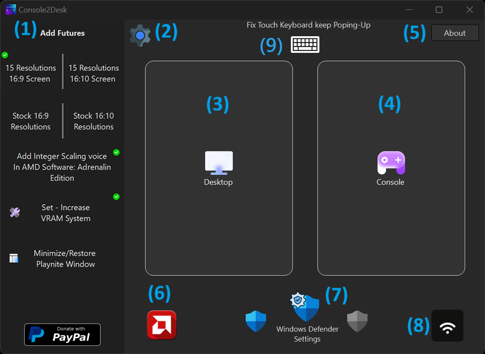
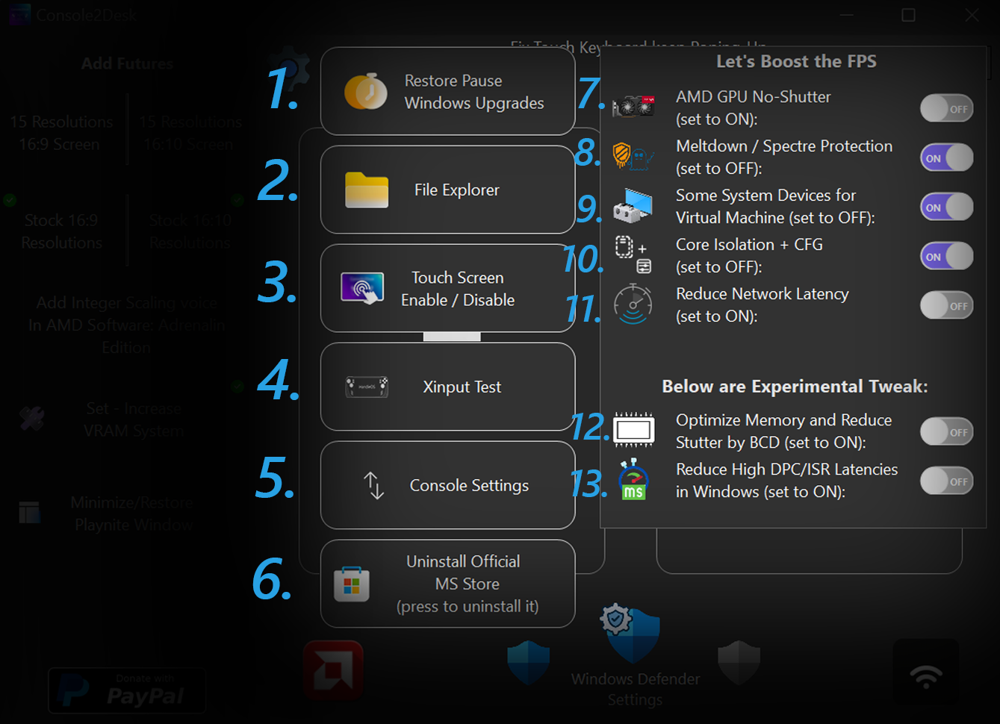
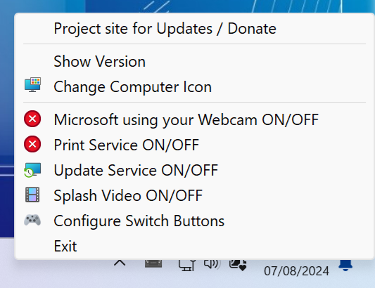

<a href="README.md" style="color: #2079C8;">Introduction</a> | <a href="installation_guide.md" style="color: #2079C8;">Download + Installation Guide</a> | <a href="features.md" style="color: #2079C8;">Features</a> | <a href="https://github.com/Special-Niewbie/HandleOS/discussions" style="color: #2079C8;">Discussions</a> | <a href="BugFix_and_NewFeatures.md" style="color: #2079C8;">Bug Fix & New Features Scheduling</a> | <a href="BCDFix.md" style="color: #2079C8;">Guide to Restoring BCD</a>

## Features

### Overview

HandleOS is not just a fast operating system, optimized with debloating techniques or designed with unique wallpapers and icons to stand out from other projects. HandleOS aims to develop open-source tools to enhance the user experience on handheld consoles/PCs, and it is also suitable for tablets or traditional PCs. Our goal is to continue advancing the development of handheld computing, making HandleOS a benchmark in the market. While Microsoft focuses on adding AI features and bloated functionalities to their OS, neglecting this important segment for enthusiasts, HandleOS steps in to fill that gap.

This is where `Console2Desk` and its companion `HotKeys4Console2Desk` come into play. In this section, I will outline what we have till now. Additional features and future improvements will be detailed in their respective sections.

  <h3><strong>Console2Desk v.2.0</strong></h3>

  
    

### 1. Add Features

- **Unlock 15 16:9/16:10 Resolutions**: This function, initially designed only for the Rog Ally 16:9 screen, has been expanded in the second version to include support for 16:10 screens as well (thanks to Prob for testing it). It increases the base screen resolutions from 3 to a total of 15. This is particularly advantageous for adapting screen resolutions to different scenarios, especially for older arcade or PC games that were designed for lower resolutions and might not run properly on newer systems with higher default resolutions.

- **Stock 3 16:9/16:10 Resolutions**: This function restores the Stock screen functions in case, for some reason, you want fewer available resolutions.

- **Add Integer Scaling voice in AMD Software: Adrenalin Edition**: This button is only for AMD APUs. It adds Integer Scaling, which is not implemented in Handhelds for some reason. This is particularly suitable for those with a handheld with a 2k (or higher) screen or those who connect the handheld to a PC monitor. This function is a "must-have" because it allows you to play natively at half resolution without degrading the image, thus increasing in-game performance.

- **Set - Increase VRAM System:** With `HandleOS_23H2v2`, you generally do not need to use this button except for 2 scenario as below. 

  - The new version of HandleOS includes optimizations for memory management that are sufficient for most scenarios. For instance, if you have 16GB of physical RAM, the pre-configured `HandleOS 8GB` of virtual RAM (in an APU scenario) is typically enough for System and GPU.

    However, if you have only `8GB` or `4GB` of physical RAM, you may consider using this button. This is particularly useful for older systems with very limited, where it can help optimize physical RAM usage by leveraging virtual RAM. 

  - Additionally, for scenarios involving `AAA games` like ***Hellblade 2*** or ***Alan Wake 2***, which are not launch on stock Windows due to insufficient physical GPU memory on first Handled generations, the new ***VRAM+*** feature in HandleOS ensures that these games can run at any resolution without encountering GPU memory errors in-game. 
    - In conclusion , while the default VRAM settings in `HandleOS_23H2v2` are suitable for most cases and you should use it to don't let the OS to use more RAM, activating `VRAM+` is recommended in situations with limited RAM or when playing demanding AAA games where in normal case wont boot and you must to activate it.

  For the vast majority of scenarios, it is recommended to stick with the default settings already configured in HandleOS_23H2v2 to maintain the best performance. However, in cases of limited physical RAM or when dealing with specific AAA games, enabling VRAM+ can provide the necessary boost to ensure smooth operation.

- **Minimize/Restore Playnite Window**: As the name suggests, this is useful if you need to force Playnite into the background for some reason. You can use Console2Desk temporarily to keep and minimize Playnite in the background.

- **PayPal**: As you might guess, this is the donation section where you can donate directly to me and support the HandleOS project if you enjoyed it.

### 2. Settings Menu
Button to open the Settings Menu, which will be discussed later.

### 3. Desktop Mode
Touch button `Desktop Mode` to switch from `Console Mode` to `Desktop Mode` in case you need to do something temporary or use your handheld or PC in the classic Windows Environment.

### 4. Console Mode
Touch button `Console Mode` to switch from the classic Windows Environment to `Console Mode` for a complete console experience.

### 5. About
 
Button `About` to check the software version or click the icon to visit my account.

### 6. AMD Adrenalin
The `AMD Adrenalin` icon opens the AMD Adrenalin Center if you want to check or modify various settings for the current game while in `Console Mode`.

### 7. Windows Security Settings
The central icon opens `Windows Security Settings` only if you are in `Desktop Mode` in case you need Windows Defender settings. The other two icons, regardless of whether you are in `Desktop Mode` or `Console Mode`, temporarily activate or deactivate Windows Defender if you need the full potential of the console without antivirus background services in-game (temporary). These work only if you have `Tamper Protection` - **disabled**; Tamper Protection security it is the service that prevents software from turning off the antivirus. I intentionally made in this light way to disable only if you turn off manually the Tamper Protection, because I didn't want the C2D software to be too invasive in this regard.

### 8. Wifi Settings

Icon to facilitate touchscreen use, by opening the settings for available Wifi networks (only if you are in `Desktop Mode`).

### 9. **Fix Touch Keyboard**:

If you turn on your Handled/PC and for some reason frequently switch few times between `Desktop Mode` and `Console Mode` - this happens in quick succession - Windows may sometimes encounter a bug that causes the Touch Keyboard to pop up every time you interact with the system.

*What This Button Does*:
The Fix Touch Keyboard button helps resolve this issue by resetting the `Touch Keyboard` functionality. After using this button, if the keyboard continues to reappear, please follow these steps:

- ***Close the Virtual Touch Keyboard:*** If the Touch Keyboard still appears, close it manually by pressing `X` window button to prevent further interruptions.

- ***Run the Function Again:*** Press the `Fix Touch Keyboard` button once more.
  - ***Use the Controller:*** Move the Controller D-Pad left and right and press some buttons in meantime the Fix Touch Keyboard button it's resetting the service (around 5 seconds).
  
  - ***Close the Keyboard Again**:* After reset, if necessary,  could pop-up the Touch Keyboard again for just a time , press the `X` on the Keyboard Window and close the keyboard manually again, and the problem it's solved.
    This process should address the issue and prevent the keyboard from reappearing.
    
    
    

----------------------------------------------------------------------------------------------------------------------------------------

### Settings Menu

1. **Restore Pause Windows Upgrades**  
As the name suggests, if you want to pause updates again to limit background services because you previously activated them, this button will pause the updates, not until the year 3000 like when the OS was first installed, but for approximately 10 to 11 years.

2. **File Explorer**  
As the name implies, this opens File Explorer in case you're in `Console Mode` and the Forwarder that allows you to open File Explorer isn't working (we'll explain what Forwarders are later).

3. **Touch Screen Enable / Disable**  
In some games, this allows you to disable the touchscreen, as there are some games where the touchscreen messes up the controls. This function enables/disables the touchscreen.

4. **Xinput Test**  
As shown in the picture below, this is an interactive section where you can test your buttons to ensure they are calibrated correctly and also test if the speakers are working properly.

5. **Console Settings**  
As shown in the picture below, this opens the Background settings for what to maintain as the UI for `Console Mode`. If you want a `Steam Deck` UI or have a game library only on `Steam`, select the appropriate icon and save. Otherwise, I've implemented a function that potentially allows you to set any executable UI you prefer if you're not familiar with Playnite.

6. **Uninstall Official MS Store (press to uninstall it)**  
     This button installs and uninstalls the MS Store. Unlike other projects out there, an external downloaded package is not used; instead, we use a restore technique for the original MS Store from the Windows ISO to increase data security. The words and function, are dynamically animated on base if you have installed or uninstalled the MS Store in your system.

     

### Let's Boost the FPS (Menu)

7. **AMD GPU No-Shutter** (set to ON):
     By default, this option is set to OFF. You should enable this feature only after you have completed installing all your drivers. The `AMD GPU No-Shutter` function is compatible exclusively with AMD GPUs and APUs. When activated, it is designed to reduce or eliminate in-game shuttering, as it helps improve the responsiveness of your GPU.  If you have an AMD GPU or APU, you can turn this option ON after all drivers are installed to improve your gaming experience by minimizing shuttering.

8. **Meltdown / Spectre Protection** (set by default to OFF):
     In early 2018, the PC industry was significantly impacted by the discovery that certain processor design features, used to enhance the performance of modern PCs, could be exploited to create severe security vulnerabilities known as Meltdown and Spectre. The industry has been actively addressing these threats through updates to operating systems, motherboard BIOSes, and CPU firmware. 
     **Meltdown and Spectre Protection:** 

     - **Meltdown**: This vulnerability affects the ability of processors to protect kernel memory. Many modern processors, particularly those from Intel, have received patches that mitigate this issue.
     -  **Spectre**: This vulnerability involves speculative execution and affects both Intel and AMD processors. Protection from Spectre may result in a reduction in system performance. When the protection is enabled, it can lead to a decrease in performance due to the additional overhead of these security measures.  
     - **For Intel CPUs:** 
       If you are using an older Intel CPU and do not install potentially unsafe software, keeping this protection turned OFF can result in a significant boost in FPS, particularly noticeable in older Intel architectures. If you have a modern Intel CPU, and install software whose safety you cannot guarantee, it is advisable to turn this protection ON to safeguard your PC and data. 
     - **For AMD CPUs:**  
       AMD CPUs are inherently immune to Meltdown attacks but may be vulnerable to some variants of Spectre. This means you can generally leave this protection OFF with less risk compared to Intel CPUs. However, if you frequently install unknown or suspicious software, it is safer to keep this protection ON. - It is recommended to run benchmarks to evaluate the impact of enabling or disabling this protection on FPS and system responsiveness. 
     - **Additional Tips:** 
       You can toggle this function ON or OFF temporarily if you notice performance differences in specific games or applications, especially AAA titles. - To ensure that changes take effect, it is best to restart your PC after making modifications to this setting.

9. **Some System Devices for Virtual Machine** (set to OFF): 
     This switch should be turned OFF only after you have completed the initial installation of all drivers on your PC, and on each ON/ OFF must to restart the Computer . 
     Here’s how to use this setting: 

     - **After Initial Driver Installation**: Once you have installed all necessary drivers for your hardware, you can consider turning this switch OFF. This setting is intended to improve system performance by disabling certain system devices that are used primarily for virtual machines. 
     - **Virtual Machines and Custom Drivers**: If you are not using virtual machines on your Handheld/PC and do not install custom drivers for any connected hardware, or if you are not installing drivers from unknown or untrusted sources, it is generally safe to disable this switch. Disabling it can lead to improved system performance, including more stable FPS and better responsiveness, especially on systems with limited power like Handhelds.
     - **When to Keep ON**: If you are using virtual machines, or if you are installing custom or unknown drivers, it is advisable to keep this switch ON to ensure system stability and compatibility. By turning this switch OFF, you may experience performance improvements such as more stable FPS and increased responsiveness, particularly beneficial for systems with limited resources. However, ensure that you have completed all necessary driver installations and are not using virtual machines before making this change.

10. **Core Isolation + CFG** (set to OFF):

       - **What is Core Isolation Memory Integrity?**    
         Core isolation provides enhanced protection against malware and other attacks by isolating critical system processes from the operating system and device. Memory integrity, a feature of core isolation, helps prevent malicious code from interfering with high-security processes. By enabling Memory Integrity, you add an additional layer of defense to protect your system from potential attacks. 
       - **What is Control Flow Guard (CFG)?**    
         Control Flow Guard (CFG) is a security feature designed to protect against memory corruption vulnerabilities. It achieves this by enforcing strict restrictions on where an application can execute code from, making it much harder for exploits to execute arbitrary code through vulnerabilities like buffer overflows. CFG builds on previous exploit mitigation technologies such as /GS (Buffer Security Check), DEP (Data Execution Prevention), and ASLR (Address Space Layout Randomization).
       - **Benefits of Core Isolation and CFG:**  
         - Prevent memory corruption and ransomware attacks by isolating critical system processes.
         - Restrict server capabilities to minimize the attack surface and reduce the risk of exploitation.  
         - Make it more difficult for attackers to exploit vulnerabilities and execute arbitrary code. 
       - **Explanation**   
         By default, Core Isolation and CFG are set to OFF to optimize performance, especially on systems with limited resources. Enabling these features provides additional security but may impact system performance. So for majority of the situation it's safe to keep turning OFF, consider enabling them if you require enhanced protection against potential threats and are willing to trade off some performance for increased security.

11. **Reduce Network Latency:**
    The `Reduce Network Latency` option is designed to optimize your network performance by adjusting the handling of network packets for online competitive Games. Here’s a brief overview of how it works and when to use it:
- **Understanding Nagle's Algorithm** - Nagle's Algorithm is a technique used to improve network efficiency by reducing the number of small packets sent over the network. It works by buffering small packets until a full-sized packet can be sent. This can be beneficial for high-bandwidth connections with large data transfers but may introduce delays in latency-sensitive applications.
        
    *Recommendations*
        
    - **For Low Latency Connections:** If you prioritize low latency and need immediate responsiveness (e.g., for online gaming or real-time applications), it is advisable to turn off Nagle's Algorithm. This allows the sender to send packets of any size immediately, reducing delays caused by buffering.
        
        - **For High Bandwidth Large Transfers:** If your primary use involves high-bandwidth connections with large data transfers (e.g., file downloads or streaming), enabling Nagle's Algorithm can be beneficial. It helps optimize the use of network bandwidth by minimizing the number of packets sent, which can improve overall transfer efficiency.

    
    ​    
    
    ***Important Note***:
    This switch applies the `Reduce Network Latency` setting, only to the currently connected network and IP address. If you change your IP address or switch to a different network, you will need to re-enable the switch to apply the setting to the new network or IP.
        
    By adjusting this setting, you can better tailor your network performance to match your specific needs, whether you require low latency for interactive applications or optimized bandwidth for large data transfers.
    
13. **Optimize Memory and Reduce Stutter by BCD** (set to ON):
        This setting is designed to optimize memory performance and reduce stuttering by modifying the Boot Configuration Data (BCD). To use this feature effectively, `Secure Boot` must be completely disabled in the BIOS. If Secure Boot is enabled, this optimization will not function as intended.  

      - **How It Works:** 
        - ***i.*** The optimization avoids the use of non-contiguous portions of low-memory from the operating system. This boosts memory performance and can improve micro-stuttering in about 80% of cases.
          - ***ii.*** It also addresses command buffer stutter, particularly after disabling 5-level paging on 10th generation Intel processors. 
            Note: that this optimization can cause system instability or freezes if the memory sticks are unstable.
          -  ***Reverting to Standard Settings:***   
            If you encounter issues with USB devices that are functional but corrupted, or if you wish to return to default system settings, you can turn the switch to OFF and re-enable `Secure Boot` in the BIOS. This will revert the system to its standard configuration and should resolve any related issues.

14. **Reduce High DPC/ISR Latencies in Windows** (set to ON):
        This setting activates a Windows tweak package that is not included by default in the operating system. It helps to mitigate issues related to high DPC (Deferred Procedure Call) and ISR (Interrupt Service Routine) latencies. It's safe to keep **ON**.  
       - **What It Does:**
         - **Tell Windows to stop tolerating high DPC/ISR latencies:**  
           By enabling this tweak, Windows is instructed to handle high latency events more aggressively, which can lead to improved system responsiveness and performance.
    
    - **Understanding DPC and ISR:**
      - ***i.*** **DPC (Deferred Procedure Call):**  
        DPCs are used to defer the execution of a task that must be handled at a later time. High DPC latency can cause system delays and affect real-time performance.
      - ***ii.*** **ISR (Interrupt Service Routine):**  
        ISRs are routines that handle hardware interrupts. High ISR latency can lead to delays in processing these interrupts, which can affect the system's responsiveness. By reducing high DPC and ISR latencies, this setting aims to enhance overall system performance and responsiveness.

### New Pointer Design in `HandleOS 23H2v2`:

 

*(The work on the pointer design is thanks to by_rosea92)*

**In `HandleOS 23H2v2` New File Explorer Icon and Playnite Forwarder**

- New File Explorer Icon: Redesigned for better usability.
- New Playnite Forwarder: Quickly access the Tools folder for frequently used system utilities.
  Reference images below:

                 

### HotKeys4Console2Desk

                 

- *Above looking from Version 2.0.0* .

  

`HotKeys4Console2Desk` is the lightweight assistant for `Console2Desk`. It's an application/service that runs in the background without a graphical interface, except for its presence in the System Tray. Above, you can see images showing its appearance in the system tray, where we have an icon, and right-clicking on it reveals other secondary options.

As we can see in the image, there are 9 options in this first version:

- **Project site for Updates / Donate**  
  This option allows you to visit the `HandleOS` page for updates or to check out various sections.

- **Show Version**  
  As the name suggests, it will show you the current version installed on your system.

- **Change Computer Icon**  
  A utility that lets you change the desktop icon of your handheld. More icons for other devices on the market will be added in the future. If your device's icon is missing, please write to me in the Discussions section of the `HandleOS` project.

  
  
- **Microsoft using your Webcam ON/OFF** 
  No one knows exactly what this service does, but it is called `Device Census` or `devicecensus.exe`. It is a legitimate Microsoft application that helps determine which build of Windows 10/11 you can upgrade to without encountering issues. Device Census is believed to have appeared during the Windows 10 2004 May Update, which was delayed for months due to hardware incompatibility. This service is also related to your webcam and its functionality. Since there is no clear documentation available on its exact role, I have included this switch in HandleOS. This allows you to enable or disable it in case you experience problems with your camera after installation. After ON or OFF better to restart the system to apply the changes.

- **Print Service ON/OFF**  
  To limit Windows background services, the print services have been disabled. If you need a printer, you can enable or disable these background services with a simple click.

- **Update Service ON/OFF**  
  This usually doesn't need to be touched, as the services should work manually by default if you want to update the operating system. However, if something goes wrong, this option reactivates the background services automatically, and you can disable them again once finished to keep the system lightweight.

- **Splash Video ON/OFF**  
  This option disables the HandleOS splash video that plays at every first launch of Playnite in `Desktop Mode`. Alternatively, you can keep it active or change the boot/waiting video that plays while Playnite loads.

- **Configure Switch Buttons**  
  This option it's  to customize controller/handled buttons for switching between active system windows. 

  * *Credits for suggestion go to `Prob`.*
  
  
  
  About `Configure Switch Buttons`, the key combinations are as follows:
  
  - **Keyboard**
    - `CTRL+SHIFT+F7` = Opens Console2Desk
  
  - **Controller/Gamepad**
    - `SELECT+START` = Opens Console2Desk (with a small vibration)
    - `SELECT+LB+RB` = As Default, switch between applications (with a small vibration).
    - `Configure Switch Buttons` = Customize your own buttons to switch between applications (with a small vibration). *Thanks to Prob for suggestions.*
  
  > ***NOTE***: `SELECT` button which means *BACK* button on XBOX controller - and the switch function has two methods. We learned that *`Lenovo Legion Go`* uses combinations with `SELECT+LB or RB`, which can cause conflicts with switch application buttons. Therefore, if you have this problem with default configurations `SELECT+LB+RB` , now you can `Configure Switch Buttons`.
  
  
  
- **Exit**  
  If you encounter problems with the program/service, you can always close it. However, it's not recommended as we'll see more functions of `HotKeys4Console2Desk` shortly.

***HotKeys4Console2Desk*** doesn't just stop there. When you plug in or unplug the charger, respective sounds will play along with a charging icon appearing. If you're gaming and don't notice the battery level, from 20% battery onward, you'll be notified every 5% with the respective icon, so you can save your gaming sessions in time.

You can also use the multitasking function to switch between apps if you're running a scaling app in parallel with your game. Below, you'll find the list of button combinations. Additionally, in an emergency, you can call up `Console2Desk` from anywhere on your computer if needed.

### AudioCCMode Volume Control (Version 2.2.0 and later)

With version 2.2.0, HandleOS introduces a new feature for managing physical volume buttons in `Console Mode`. Previously, volume adjustments using physical buttons were not supported in this mode.

Now, thanks to the new `AudioCCMode` service, HandleOS can handle all physical volume buttons while in `Console Mode`. This enhancement allows you to adjust the volume directly using the hardware buttons on your device, providing greater convenience and control over your audio settings without needing to navigate through on-screen menus.

## HandleOS Tab View (Version 2.2.0 and later)

Starting from version 2.2.0, `HandleOS Tab View` is an enhanced window switching experience in `Console Mode`. 

You can use `HandleOS Tab View` in two ways:

1. **Informational View**: This mode displays a preview of the windows you're switching between. The view will automatically close after approximately 6 seconds if no selection is made.
2. **Interactive View**: Use the D-Pad on your controller to navigate through the available windows. Press the `A` button to select a window for immediate switching.

This dual functionality makes it easier to manage your switch between windows more efficiently.
