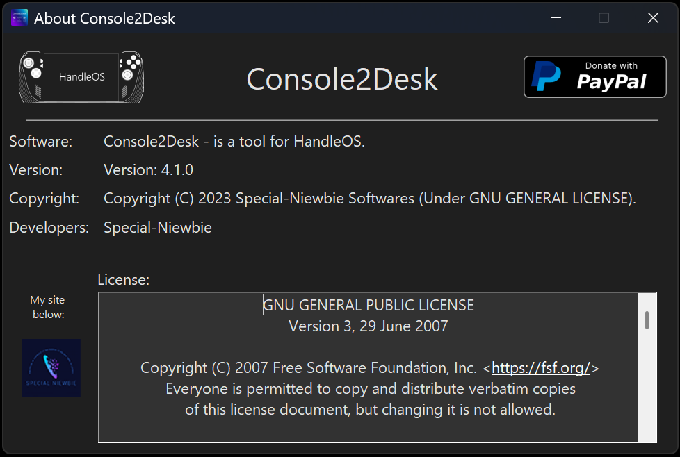
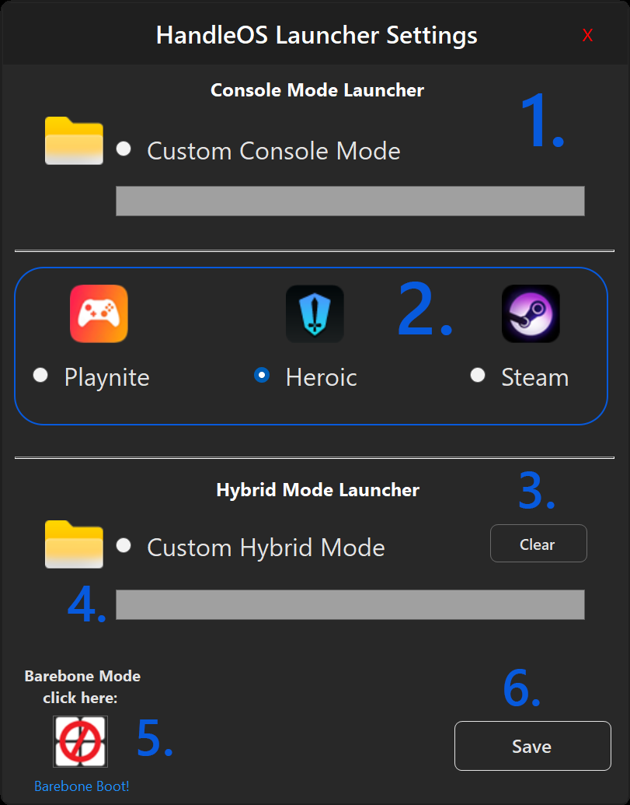
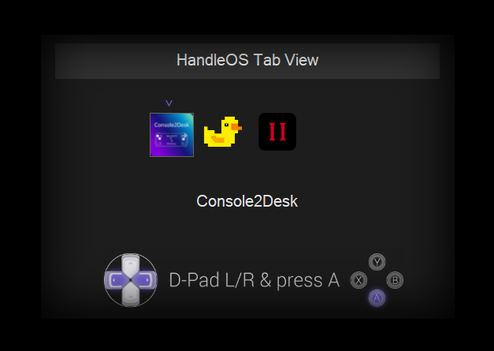

<a href="README.md" style="color: #2079C8;">Introduction</a> | <a href="installation_guide.md" style="color: #2079C8;">Download + Installation Guide</a> | <a href="features.md" style="color: #2079C8;">Features</a> | <a href="https://github.com/Special-Niewbie/HandleOS/discussions" style="color: #2079C8;">Discussions</a> | <a href="BugFix_and_NewFeatures.md" style="color: #2079C8;">Bug Fix & New Features Scheduling</a> | <a href="BCDFix.md" style="color: #2079C8;">Guide to Restoring BCD</a> | <a href="TB.md" style="color: #2079C8;">Tweak Paradise</a>

## Features

### Overview

HandleOS is not just a fast operating system, optimized with debloating techniques or designed with unique wallpapers and icons to stand out from other projects. HandleOS aims to develop open-source tools to enhance the user experience on handheld consoles/PCs, and it is also suitable for tablets or traditional PCs. Our goal is to continue advancing the development of handheld computing, making HandleOS a benchmark in the market. While Microsoft focuses on adding AI features and bloated functionalities to their OS, neglecting this important segment for enthusiasts, HandleOS steps in to fill that gap.

This is where `Console2Desk` and its companion `HotKeys4Console2Desk` come into play. In this section, I will outline what we have till now. Additional features and future improvements will be detailed in their respective sections.

  <h3><strong>Console2Desk v3.8.0</strong></h3>

  
    

### 1. Add Features

- **Unlock 15 16:9/16:10 Resolutions**: This function, initially designed only for the Rog Ally 16:9 screen, has been expanded in the second version to include support for 16:10 screens as well (thanks to Prob for testing it). It increases the base screen resolutions from 3 to a total of 15. This is particularly advantageous for adapting screen resolutions to different scenarios, especially for older arcade or PC games that were designed for lower resolutions and might not run properly on newer systems with higher default resolutions.

- **Stock 3 16:9/16:10 Resolutions**: This function restores the Stock screen functions in case, for some reason, you want fewer available resolutions.

- **Add Integer Scaling voice in AMD Software: Adrenalin Edition**: This button is only for AMD APUs. It adds Integer Scaling, which is not implemented in Handhelds for some reason. This is particularly suitable for those with a handheld with a 2k (or higher) screen or those who connect the handheld to a PC monitor. This function is a "must-have" because it allows you to play natively at half resolution without degrading the image, thus increasing in-game performance.

- **Set - Increase VRAM System:** With `HandleOS_23H2v2`, you generally do not need to use this button except for 2 scenario as below. 

  - The new version of HandleOS includes optimizations for memory management that are sufficient for most scenarios. For instance, if you have 16GB of physical RAM, the pre-configured `HandleOS 8GB` of virtual RAM (in an APU scenario) is typically enough for System and GPU.

    However, if you have only `8GB` or `4GB` of physical RAM, you may consider using this button. This is particularly useful for older systems with very limited, where it can help optimize physical RAM usage by leveraging virtual RAM. 

  - Additionally, for scenarios involving `AAA games` like ***Hellblade 2*** or ***Alan Wake 2***, which are not launch on stock Windows due to insufficient physical GPU memory on first Handled generations, the new ***VRAM+*** feature in HandleOS ensures that these games can run at any resolution without encountering GPU memory errors in-game. 
    - In conclusion , while the default VRAM settings in `HandleOS_23H2v2` are suitable for most cases and you should use it to don't let the OS to use more RAM, activating `VRAM+` is recommended in situations with limited RAM or when playing demanding AAA games where in normal case wont boot and you must to activate it.

  For the vast majority of scenarios, it is recommended to stick with the default settings already configured in HandleOS_23H2v2 to maintain the best performance. However, in cases of limited physical RAM or when dealing with specific AAA games, enabling VRAM+ can provide the necessary boost to ensure smooth operation.

- **HandleOS NEWS:** A small window that keeps us updated on when we can all upgrade to the next Windows release together!

- **Dynamic icon:** Displays and alerts users on how many controllers are connected. 
  New features from 3.0.0 now C2D support up to 4 Controllers.

- **PayPal**: As you might guess, this is the donation section where you can donate directly to me and support the *HandleOS* / *C2D* project if you enjoyed it.

### 2. Settings Menu
Button to open the Settings Menu, which will be discussed later below.

### 3. **Tweak Paradise**:
Starting from ***C2D ver 3.8.0***, a new button has been introduced with a dedicated section for HandleOS users called `Tweak Paradise`. This is where we'll push the hardware to its limits, offering an array of switches and options to optimize performance (more switches will be added in future updates).

For more details on the available switches, please visit below page:

<a href="TP.md" style="color: #2079C8;">Tweak Paradise</a>.

### 4. **Fix Touch Keyboard**:

If you turn on your Handled/PC and for some reason frequently switch few times between `Desktop Mode` and `Console Mode` - this happens in quick succession - Windows may sometimes encounter a bug that causes the Touch Keyboard to pop up every time you interact with the system.

*What This Button Does*:
The Fix Touch Keyboard button helps resolve this issue by resetting the `Touch Keyboard` functionality. After using this button, if the keyboard continues to reappear, please follow these steps:

- ***Close the Virtual Touch Keyboard:*** If the Touch Keyboard still appears, close it manually by pressing `X` window button to prevent further interruptions.

- ***Run the Function Again:*** Press the `Fix Touch Keyboard` button once more.
  - ***Use the Controller:*** Move the Controller D-Pad left and right and press some buttons in meantime the Fix Touch Keyboard button it's resetting the service (around 5 seconds).

  - ***Close the Keyboard Again**:* After reset, if necessary,  could pop-up the Touch Keyboard again for just a time , press the `X` on the Keyboard Window and close the keyboard manually again, and the problem it's solved.
    This process should address the issue and prevent the keyboard from reappearing.

### 5. Info Button

The Info button will display a window, as shown in the image below, indicating the Mouse/Keyboard commands that your game controller takes over while Console2Desk is active. From version 3.0.0 C2D it supports up to 4 Controllers simultaneously to get mouse and Keyboard behaviour .This feature helps users navigate seamlessly without needing to use a mouse or keyboard, making it easier to control the system purely with a game controller. 

**If you need to browse through folders or perform various operations in system menus, it's recommended to keep C2D minimized during these tasks, as leaving the window normal may interfere with smooth navigation in the system.**

### 6. About

 
Button `About` to check the software version or click the icon to visit my account with some general info about C2D.

### 7. Desktop Mode

Touch button `Desktop Mode` to switch from `Console Mode` to `Desktop Mode` in case you need to do something temporary or use your handheld or PC in the classic Windows Environment.

### 8. Console Mode
Touch button `Console Mode` to switch from the classic Windows Environment to `Console Mode` for a complete console experience.

### 9. Minimize/Restore/Open - Steam/Playnite

From 3.1.0 version, now it maximizes, minimizes, and re-opens (if mistakenly closed) the pre-configured program for Console Mode.

### 10. Dynamic ON/OFF Icon for Windows Defender

Starting from ***C2D ver 3.8.0***, the Windows Defender dynamic icon can now be disabled in `Console Mode`, so there's no need to switch to `Desktop Mode`to turn it off anymore (as the previous C2D versions) .

:information_source:*This working only if you have `Tamper Protection` - **disabled**:*

- *Tamper Protection security it is the service that prevents software from turning off the antivirus. I intentionally made in this light way to disable only if you turn off manually the Tamper Protection, because I didn't want the C2D software to be too invasive in this regard.*

### 11. Windows Security Settings

The central icon opens `Windows Security Settings` only if you are in `Desktop Mode` in case you need Windows Defender settings. 

### 12. AMD Adrenalin
The `AMD Adrenalin` icon opens the `AMD Adrenalin Center` if you want to check or modify various settings for the current game while in `Console Mode`.

### 13. Wifi Settings

Starting from ***C2D ver 3.8.0***:

1. **Desktop Mode**: As shown in the image below, this mode open the classic Windows Menu for managing WiFi networks.

   

   

2. **Console Mode**: Redesigned from the ground up to work seamlessly within C2D, this mode offers a closely mirroring the Windows experience, and can be accessed directly from C2D. A preview is shown in the mage below.

   

### 14. Power OFF Menu

Starting from ***C2D ver 3.8.0***, a new button and rebuilt the Windows menu for Shutting Down, Restarting, and Turning Off the monitor of your device, directly from C2D.

----------------------------------------------------------------------------------------------------------------------------------------

  <h3><strong>Menu Settings </strong></h3>

  
    

1. **Restore the Pause Windows Upgrades**  
As the name suggests, if you want to pause updates again (after reactivated by Windows Settings) to limit background services, this button will pause the updates, until the year 3000.

2. **File Explorer As Admin**  
As the name implies, this opens File Explorer with full Administration privileges in case you're in `Console Mode` .

3. **Touch Screen Enable / Disable**  
In some games, this allows you to disable the touchscreen, as there are some games where the touchscreen messes up the controls. This function enables/disables the touchscreen.

4. **Xinput Test**  
As shown in the picture below, this is an interactive section where you can test your buttons to ensure they are calibrated correctly and also test if the speakers or other hardware components are working properly.

5. **Console Settings**  
As shown in the picture below, this opens the Background settings for what to maintain as the UI for `Console Mode`. If you want a `Steam Deck` UI or have a game library only on `Steam`, select the appropriate icon and save. Otherwise, I've implemented a function that potentially allows you to set any executable UI you prefer if you're not familiar with Playnite or Steam. `But first check if Console Mode it's compatible with that personalized .exe, as any software by Windows Store - for now - are not compatible with Console Mode`.

6. **Uninstall Official MS Store (press to uninstall it)**  
     This button installs and uninstalls the MS Store. Unlike other projects out there, an external downloaded package is not used; instead, we use a restore technique for the original MS Store from the Windows ISO to increase data security. The words and function, are dynamically animated on base if you have installed or uninstalled the MS Store in your system.

6. **HandleOS Benchmark**
   `Windows Experience Index` resurrected from <u>Windows 7</u>, called `HandleOS Benchmark`, a new companion for the flagship C2D to measure the performance of your Handled.

6. **HandleOS Restore Boost**:
   Exclusively for HandleOS users, to maintain system boost and performance after Windows updates. `Fix Wifi` his a button to restores the WiFi service in cases where it disappears from the Windows Taskbar, an issue affecting some devices. 

   

6. **Temporary Desktop Mode:** 
   This button helps you switch to **Desktop Mode temporarily** (*without making it permanent*). It is especially useful when you need to perform temporary tasks in `Desktop Mode`. Upon reboot, the device will return to `Console Mode`.

6. **HandleOS Hibernation / Sleep / Standby**:
   Starting from ***C2D ver 3.8.0***, this button opens a menu to fully reactivate the functionalities of `Sleep Mode` and `Hibernate Mode`. In the opened window, it explains the `Pros` and `Cons` of enabling these features, as HandleOS has them disabled by default.

   

### New Pointer Design in `HandleOS 23H2v2`:

 

*(The work on the pointer design is thanks to by_rosea92)*

**In `HandleOS 23H2v2` New File Explorer Icon and Playnite Forwarder**

- New File Explorer Icon: Redesigned for better consistency of style. 
  Reference image:   

- New Playnite Forwarder: 
  Quickly access the Tools folder for frequently used system utilities.
  Reference image:  
  
- **What are Forwarders?**

  Forwarders are small helper tools for the Playnite UI. They allow Playnite to open system components, like `File Explorer`, and then go into the background, letting you perform your tasks without Playnite's limitations. These forwarders are simple floating buttons; when clicked, they close the forwarder and components and return Playnite to full-screen mode, ready for use again.

​                 

### HotKeys4Console2Desk

                

- *Above looking from Version 3.8.0* 

  

`HotKeys4Console2Desk` is the lightweight assistant for `Console2Desk`, and from version 3.0.0 it supports up to 4 Controllers simultaneously. It's an application/service that runs in the background without a graphical interface, except for its presence in the System Tray and it's Menu tools. Above, you can see images showing its appearance in the system tray, where we have an icon, and right-clicking on it reveals other secondary options.

As we can see in the image, there are 9 options in this first version:

- **Project site for Updates / Donate**  
  This option allows you to visit the `HandleOS` page for updates or to check out various sections.

- **Show Version**  
  As the name suggests, it will show you the current version installed on your system.

- **Change Computer Icon**  
  A utility that lets you change the desktop icon of your handheld. More icons for other devices on the market will be added in the future. If your device's icon is missing, please write to me in the Discussions section of the `HandleOS` project.

  
  
  
  
- **Cursor Theme Dark/Light**
  Switch Mouse Pointer theme between `Light Mode` and `Dark Mode` when using Desktop Mode.

- **Tablet Mode ON/OFF**
  Button to transform the Windows messages and Taskbar into `Tablet Mode`, perfect feature for handheld devices. (Thanks to [@alcopsy](https://github.com/alcopsy))

  
  
- **Clipboard history ON/OFF**
  
  Since HandleOS disables it by default, to minimize background services, users who need this feature can now reactivate it via the HotKeys4Console2Desk menu. (Thanks to [@alcopsy](https://github.com/alcopsy))
  
- **Microsoft using your Webcam ON/OFF** 
  No one knows exactly what this service does, but it is called `Device Census` or `devicecensus.exe`. It is a legitimate Microsoft application that helps determine which build of Windows 10/11 you can upgrade to without encountering issues. Device Census is believed to have appeared during the Windows 10 2004 May Update, which was delayed for months due to hardware incompatibility. This service is also related to your webcam and its functionality. Since there is no clear documentation available on its exact role, I have included this switch in HandleOS. This allows you to enable or disable it in case you experience problems with your camera after installation. After ON or OFF better to restart the system to apply the changes.

- **Print Service ON/OFF**  
  To limit Windows background services, the print services have been disabled. If you need a printer, you can enable or disable these background services with a simple click.

- **Update Service ON/OFF**  
  This usually doesn't need to be touched, as the services should work manually by default if you want to update the operating system. However, if something goes wrong, this option reactivates the background services automatically, and you can disable them again once finished to keep the system lightweight.

- **Splash Video ON/OFF**  
  This option disables the HandleOS splash video that plays at every first launch of Playnite in `Desktop Mode`. Alternatively, you can keep it active or change the boot/waiting video that plays while Playnite loads.

- **Configure Switch Buttons**  
  This option it's  to customize controller/handled buttons for switching between active system windows. 

  * *Credits for suggestion go to `Prob`.*
  
  
  
  Below, you'll find the list of button combinations. Additionally, in an emergency, you can call up `Console2Desk` from anywhere on your computer if needed.
  
  About `Configure Switch Buttons`, the key combinations are as follows:
  
  - **Keyboard**
    - `CTRL+SHIFT+F7` = Opens Console2Desk
  
  - **Controller/Gamepad**
    - `SELECT+START` = Opens Console2Desk (with a small vibration)
    - `SELECT+LB+RB` = As Default, switch between applications (with a small vibration).
    - `Configure Switch Buttons` = Customize your own buttons to switch between applications (with a small vibration). *Thanks to Prob for suggestions.*
  
  > ***NOTE***: `SELECT` button which means *BACK* button on XBOX controller - and the switch function has two methods. We learned that *`Lenovo Legion Go`* uses combinations with `SELECT+LB or RB`, which can cause conflicts with switch application buttons. Therefore, if you have this problem with default configurations `SELECT+LB+RB` , now you can `Configure Switch Buttons`.
  
  
  
- **Exit**  
  If you encounter problems with the program/service, you can always close it. However, it's not recommended as we'll see more functions of `HotKeys4Console2Desk` shortly.

***HotKeys4Console2Desk*** doesn't just stop there. When you plug in or unplug the charger, respective sounds will play along with a charging icon appearing. If you're gaming and don't notice the battery level, from 20% battery onward, you'll be notified every 5% with the respective icon, so you can save your gaming sessions in time.

### AudioCCMode Volume Control (Version 2.2.0 and later)

With version 2.2.0, HandleOS introduces a new feature for managing physical volume buttons in `Console Mode`. Previously, volume adjustments using physical buttons were not supported in this mode.

Now, thanks to the new `AudioCCMode` service, HandleOS can handle all physical volume buttons while in `Console Mode`. This enhancement allows you to adjust the volume directly using the hardware buttons on your device, providing greater convenience and control over your audio settings without needing to navigate through on-screen menus.

## HandleOS Tab View (Version 2.2.0 and later)

You can also use the multitasking function to switch between apps if you're running a scaling app in parallel with your game. 

Starting from version 2.2.0, `HandleOS Tab View` is an enhanced window switching experience in `Console Mode`. 

You can use `HandleOS Tab View` in two ways:

1. **Informational View**: This mode displays a preview of the windows you're switching between. The view will automatically close after approximately 5 seconds if no selection is made.
2. **Interactive View**: Use the D-Pad on your controller to navigate through the available windows. Press the `A` button to select a window for immediate switching.

This dual functionality makes it easier to manage your switch between windows more efficiently.
