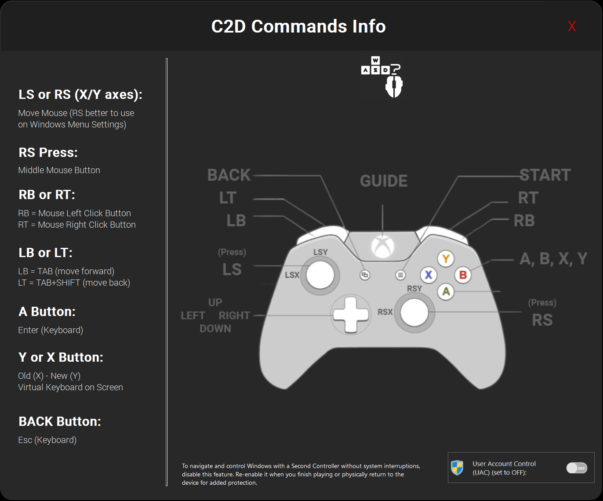
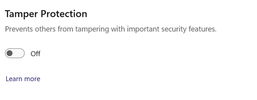

<a href="README.md" style="color: #2079C8;">Introduction</a> | <a href="installation_guide.md" style="color: #2079C8;">Download + Installation Guide</a> | <a href="features.md" style="color: #2079C8;">Features</a> | <a href="https://github.com/Special-Niewbie/HandleOS/discussions" style="color: #2079C8;">Discussions</a> |<a href="HybridvsConsole.md" style="color: #2079C8;">Hybrid Mode vs Console Mode</a> | <a href="BCDFix.md" style="color: #2079C8;">Guide to Restoring BCD</a> | <a href="TP.md" style="color: #2079C8;">Tweak Paradise</a> | <a href="PrivacyPolicy.md" style="color: #2079C8;">Policy Privacy</a>

# Features

### Overview

HandleOS is not just a fast operating system, optimized with debloating techniques or designed with unique wallpapers and icons to stand out from other projects. HandleOS aims to develop open-source tools to enhance the user experience on handheld consoles/PCs, and it is also suitable for tablets or traditional PCs. My goal is to continue advancing the development of handheld computing, making HandleOS a benchmark in the market. While Microsoft focuses on adding AI features and bloated functionalities to their OS, neglecting this important segment for enthusiasts, HandleOS steps in to fill that gap.

This is where `Console2Desk` and its companions come into play. In this section, I will outline what we have till now. Additional features and future improvements will be detailed in their respective sections.

  <h3><strong>Console2Desk v4.1.0</strong></h3>

  
    

### Quick Menu

### 1. **Dynamic ON/OFF Icon for Windows Defender**: 
Windows Defender dynamic icon, Defender can now be disabled in `Console Mode`, so there's no need to switch to `Desktop Mode`to turn it off anymore (as the previous C2D versions) .

   :information_source:*This working only if you have `Tamper Protection` - **disabled**:*

   *Tamper Protection security it is the service that prevents software from turning off the antivirus. I intentionally made in this light way to disable only if you turn off manually the Tamper Protection, because I didn't want the C2D software to be too invasive in this regard.*

### 2. **Tweak Paradise**: 
   Starting from ***C2D ver 3.8.0***, a new button has been introduced with a dedicated section for `HandleOS` users called `Tweak Paradise`. This is where we'll push the hardware to its limits, offering an array of switches and options to optimize performance (more switches will be added in future updates).

   For more details on the available switches, please visit below page: <a href="TP.md" style="color: #2079C8;">Tweak Paradise</a>.

   

### 3.  **Fix Touch Keyboard**: 

If you frequently switch between **Desktop Mode** and **Hybrid Mode / Console Mode** in quick succession, Windows may sometimes encounter a bug that causes the **Touch Keyboard** to pop up every time you interact with the system using your **XBOX controller**.  
     
**What This Button Does**  
     
The **Fix Touch Keyboard** button provides a solution by resetting the **Touch Keyboard** service. When you press this button, a prompt will appear with three options:  
     
 - **Yes**: This resets the **Touch Keyboard** service. A small countdown (approximately **5 seconds**) will appear while the reset is in progress.  
     - **No**: This completely disables the **Touch Keyboard**, preventing it from appearing if the bug persists.  
     - **Cancel**: This does nothing and simply closes the prompt.  
     
     **Additional Steps if the Issue Persists**:  
     
     If the **Touch Keyboard** still appears after selecting **Yes**, try the following steps:  
     -- `Close the Virtual Touch Keyboard Manually:`
     
  - If the keyboard still appears, close it by clicking the **X** button in the window to prevent further interruptions.  
    
     -- `Run the Fix Touch Keyboard Function Again:`
     
       - Press the **Fix Touch Keyboard** button once more to ensure the service is fully reset.  
     
    -- `Use the Controller While Resetting:`
    
   - Move the **D-Pad left and right** and press some buttons while the **Fix Touch Keyboard** function is running (for about **5 seconds**) to verify that input is being registered correctly.  
     
     This feature ensures to correct if the bug appears in the **Touch Keyboard** and behaves correctly.

  ***PS:***`Close the Keyboard Again` after reset with **Yes** or **No** choice , if necessary,  because could pop-up the Touch Keyboard again for just a time , and press the `X` on the main window of the Keyboard to close it manually, and the bug should disappear.
This process should address the issue and prevent the keyboard from reappearing.

### 4. **VRAM+ Configuration – When and How to Use It:** 

   

   

   ⚠️ **Important:** Those Switches **should not be used frequently**. It should be set **once or at most twice**, as repeatedly changing it may cause **excessive fragmentation of your SSD/NVMe**, potentially reducing its performance over time.

   Primarily it's useful to use it at the beginning of your **OS installation** or after upgrading your **RAM**.  

   Below is a breakdown of when to use this menu and what each **VRAM+ switch** does:  

   #### **Default HandleOS VRAM Management**  

   The latest version of **HandleOS** includes optimizations for **memory management**, making it sufficient for most scenarios.  
   For example, if you have **16GB of physical RAM**, the pre-configured **HandleOS 8GB** of virtual RAM (for an **APU scenario**) is typically enough for both the **System** and **GPU**.  

   However, for specific cases, you may need to adjust VRAM settings manually using the available **three switches**:  

   #### **1️⃣ VRAM OFF (First Switch - Left)**  
   - **Enable this switch if you have 32GB or more of RAM**.  
   - This disables extra VRAM allocation, ensuring your system relies on its **physical RAM** without unnecessary virtual memory usage.  

   #### **2️⃣ Standard HandleOS VRAM (Second Switch - Middle)**  
   - This it's default `HandleOS` settings, or this switch should **only** be used in two specific cases:  
     - If your system has **less than 2GB of RAM**.  
     - If your system has **exactly 24GB of RAM**.  

   #### **3️⃣ VRAM+ for limited RAM and run AAA Games (Third Switch - Right)**  
   - This switch is **essential for handheld devices with limited RAM** (the range it's **4GB to 16GB**).  
   - Activating **VRAM+** ensures that demanding **AAA games**—such as ***Hellblade 2*** or ***Alan Wake 2***—can run **without encountering GPU memory errors**.  
   - Some **first-generation handheld devices** cannot launch these games on **stock Windows** due to insufficient **physical GPU memory**, but **VRAM+** helps this limitation.  

   #### **Final Recommendation**  

   The **"Not-Ready to Defrag!"** button is a dynamic control designed to optimize disk defragmentation by ensuring a clean VRAM configuration before the process begins. It is recommended to use this feature when you want apply the defragmentation to your system with your preferred Defragmentation Software,  approximately should be every **six months** for normal user , to maintain disk health and prevent excessive data fragmentation.

   Before starting the defragmentation, first set **VRAM to "OFF"**, then press the **"Not-Ready to Defrag!"** button to switch it to **"Ready to Defrag!"** mode. This step resets any previously applied VRAM settings, ensuring a thorough and efficient defragmentation process for your disk health.

   After rebooting your system, temporarily disabling any your antivirus software, and proceed with SSD/HDD defragmentation. Once the process is complete, you can **reapply your preferred VRAM configuration** and then press the **"Ready to Defrag!"** button again to return it to its default **"Not-Ready to Defrag!"** state.

   By following this procedure, you ensure that your system remains responsive while preventing long-term data fragmentation, keeping your storage optimized for better performance.

### 5. **GPU Center**:

   The **AMD, Intel, and NVIDIA** buttons are designed to **open their respective GPU control panels** for quick access to graphics settings.  

   - *If any of these buttons do not work on your device, please let me know. Some **Handled** installations may differ, which can prevent the GPU settings panel from opening / appear. In such cases, we can add the necessary configuration to ensure compatibility.*  

### 6. **Custom Apps**: 

   

       
       
   

   #### Quick Access to your Favourite Applications in Console2Desk  

   A new feature has been added to **Console2Desk (C2D)**, allowing you to **register up to three favourites applications** for quick access directly from the main UI.  

   Three **cross-shaped boxes** are now available for adding your preferred apps, supporting both **mouse** and **touch screen** interaction:  

   ##### 🔹 Using a Mouse  
   - **Right-click** on one of the three cross icons to open a pop-up window where you can browse and select your favorite application.
   -   **Left-click** on an added application icon to **launch** the app
   - To **remove** an app from its box, **double-click** the icon with the **left mouse button**—a confirmation message will appear before deletion.  

   ##### 🔹 Using a Touch Screen  
   - **Press and hold** on one of the adding cross icons for **at least 3 seconds** to open the pop-up window and select your app.
   - **One tap** on an added application icon will **launch** the app.  
   - To **remove** an app, **double-tap** the icon, and a confirmation message will appear before deletion.  

   This feature makes launching frequently used applications **faster and more intuitive**, whether you're using a **mouse** or a **touchscreen device**.  

### 7. **HandleOS NEWS:** 

   A small window that keeps us updated on different HandleOS news!

- **Dynamic icon:** Displays and alerts users on how many controllers are connected. 
  New feature from 3.0.0 now C2D support up to 4 Controllers.

- **PayPal**: As you might guess, this is the donation section where you can donate directly to me and support the *HandleOS* / *C2D* project if you enjoyed it.

### 8. Settings Menu
Button to open the Settings Menu, which will be discussed later below.

### 9. **Commands Info**:

The Info button will display a window, as shown in the image below, indicating the Mouse/Keyboard commands that your XBOX controller takes over while Console2Desk is active. From version 3.0.0 C2D it supports up to 4 Controllers simultaneously to get mouse and Keyboard behaviour .This feature helps users navigate seamlessly without needing to use a mouse or keyboard, making it easier to control the system purely with a game controller. 

⚠️ **If you need to browse through folders or perform various operations in system menus, it's recommended to keep C2D minimized during these tasks, as leaving the window normal may interfere with smooth navigation in the system.**

   

### 10. **About**:

   

Button `About` to check the software version or click the icon to visit my account with some general info about C2D.

### 11. Desktop Mode:

Button `Desktop Mode` to switch from **Hybrid Mode**  or **Console Mode** back to `Desktop Mode` , in case you need to do something temporary or use your handheld or PC as Desktop in the classic Windows Environment.

### 12. Hybrid Mode:

**Hybrid Mode** offers a unique and advanced functionality that differs from **Console Mode**. In this mode, you gain the ability to run any application or system function that would typically cause errors or be inaccessible the **UWP Windows** apps in **Console Mode**—such as **Windows Settings**, **Microsoft Store**, **GamePass**, **Asus Armoury Crate for Handled** and more.

In **Hybrid Mode**, the **Windows UI** is suppressed. This means that Windows operates as if it's running normally, but without displaying its default UI. This creates a seamless integration, allowing for system-level functionality while giving us the flexibility to manipulate the user interface.

One of the key features of **Hybrid Mode** is the `custom context menu` called **HandleOS Touch Menu** that replace Windows context menu and appears when navigating through folders. This menu is specifically designed for **Handled Touch Screen devices** as below picture.

    
    

This approach unlocks a wealth of possibilities for us. You can maintain a fully functional Windows environment while manipulating and even replacing its UI with something new, custom interface, all while keeping the underlying Windows operations intact.

### 13. Desktop Temporary Mode:

This button helps you switch to **Desktop Mode** temporarily without making the change permanent after a reboot. It is especially useful when you need to perform temporary tasks in **Desktop Mode**, such as system configurations or working with desktop-specific applications.

Once you reboot the device, it will automatically return to **Hybrid Mode** or **Console Mode** (depending on which mode was active from **Desktop Mode** previously).

### 14. Console Mode:
**Console Mode** is a more legacy method that differs significantly from **Hybrid Mode**. It is ideal for users who do not require Windows' full UI services and are focused primarily on running classic **.exe** applications, which do not rely on the Windows graphical interface and services.

This mode is highly suitable for those who want to maximize system performance by limiting unnecessary background processes and services associated with the UI. If you are one of these users and your applications don't require advanced UI Modern features/ services, switching to **Console Mode** is a great option to free up some system resources and improve overall performance.

### 15. Minimize/Restore/Open - Heroic/Steam/Playnite:

This button maximizes, minimizes, and re-opens (if mistakenly closed) the pre-configured program for **Hybrid Mode** and **Console Mode**, but specially it's coded to work with the 3 most famous launchers.

### 16. Wifi Settings:

**Desktop Mode**: As shown in the image below, this buttons it open the classic Windows Menu for managing WiFi networks.

   

   

**Hybrid Mode** /**Console Mode**: In these two modes, I have redesigned the WiFi interface from the ground up to work seamlessly within C2D. This mode offers an experience closely mirroring Windows, directly integrated into C2D. A preview is shown in the image below:  

   

### 17. Power OFF Menu

Starting from ***C2D ver 3.8.0***, a new button and rebuilt the Windows menu for **Shutting Down**, **Restarting**, and **Turning Off the monitor** of your device, directly from C2D.

   

----------------------------------------------------------------------------------------------------------------------------------------

  <h1><strong>Menu Settings </strong></h1>

  
    

1. **Restore the Pause Windows Upgrades**  
As the name suggests, if you want to pause updates again (after reactivated by Windows Settings) to limit background services, this button will pause the updates, until the year 3000.

2. **File Explorer As Admin**  
As the name implies, this opens File Explorer with full Administration privileges in case you're in `Console Mode` .

3. **Touch Screen Enable / Disable**  
For some games, this allows you to disable/re-enable the device touchscreen, as there are some games where the touchscreen messes up with the controls. This function enables/disables the touchscreen.

4. **Xinput Test**  
As shown in the picture below, this is an interactive section where you can test your buttons to ensure they are calibrated correctly and also test if the speakers or other hardware components are working properly.

5. **HandleOS Launcher Settings**:

   

  

  This section allows you to configure how HandleOS launches your preferred programs, games, or launchers instead of Windows UI. You can choose between **Console Mode** and **Hybrid Mode**, each offering different levels of Windows UI integration (here it's the guide of these 2 options <a href="HybridvsConsole.md" style="color: #2079C8;">Hybrid Mode vs Console Mode</a>). Below are the five key features available in this settings window:  

  1️⃣. **Console Mode Launcher**  
     This option allows you to set a launcher, game, or application to start in **Console Mode**, replacing the Windows UI. Console Mode is a more restrictive, legacy-friendly environment that disables most Windows UI elements to free up system resources. Before enabling this mode, click the link above to understand the differences between **Hybrid Mode** and **Console Mode**.  

  2️⃣. **Preconfigured Launcher Selection**  
     In this section, you can select from three popular preconfigured launchers: **Playnite, Heroic, or Steam** (Steam must be installed separately). Once you choose one and only in this section, a confirmation window will appear, as shown in the image below to understand if you want set only for **Hybrid Mode** or **Console Mode**:  

 
    
In this second window, you can specify whether you want your selected launcher to start in **Hybrid Mode** or **Console Mode**. If you're unsure which to choose, refer to this guide: [<a href="HybridvsConsole.md" style="color: #2079C8;">Hybrid Mode vs Console Mode</a>]. After making your choice, click **Save** (see point 5).  
    
Once saved, your chosen launcher will automatically start every time HandleOS boots, as long as you have selected the corresponding mode in the main settings window (**Hybrid Mode** or **Console Mode**). If you select **Console Mode**, the Windows UI will be completely disappear, creating a console-like experience.    
To return to the standard Windows Desktop, use the **Console2Desk** shortcut keys combination (explained in another section of the guide or in the main page project) and switch back to **Desktop Mode**.  

  3️⃣. **Clear Hybrid Mode Button**  
     This button is specifically for **Hybrid Mode** users. Since **Hybrid Mode** allows full compatibility with standard Windows applications, this button lets you clear any previously set programs for **Hybrid Mode** (configured in points 2 or 4) as otherwise when you switch back to `Hybrid Mode` will launch the software already set previously.  

Why is this needed? Some Microsoft Store apps, **UWP programs**, or applications in restricted directories (such as **Asus Armoury Crate for ROG Ally** or **Game Pass**) may be configured to launch automatically at system startup. In these cases, there’s no need to manually set them as startup applications within HandleOS. Instead, **Hybrid Mode** simply removes the Windows UI while letting these applications launch on their own. Anyway, this button provides users with greater flexibility by allowing them to clear any previously set launchers if needed.  

  4️⃣. **Hybrid Mode Launcher**  
     Similar to the **Console Mode Launcher** option, this setting allows you to specify a Custom launcher, game, or application to start in **Hybrid Mode** instead of Windows UI. `Hybrid Mode` maintains full Windows compatibility while removing completely the Windows UI.  

  5️⃣. **Save Button**  
     After configuring your preferred launcher, game, or application, in one of the above points you must **click the Save button** to store your settings. If you do not save your changes, your configurations will not take effect when switching to **Hybrid Mode** or **Console Mode**.  

6. **Install/Uninstall MS Store (the button it's dynamic, and changes the words on base if the MS Store it's installed or not)**  
     This button installs and uninstalls the MS Store. Unlike other projects out there, an external downloaded package is not used; instead, I use a restore technique for the original MS Store from the official Windows ISO to increase data security. The words and function, are dynamically animated on base if you have installed or uninstalled the MS Store in your system.

7. **HandleOS Benchmark**

   

       
       
   

   

   From Version of 2.7.0, C2D has a new companion for our handhelds: the new **HandleOS Benchmark**. This tool, revived from the past and completely redesigned and rebuilt from the ground up, offers more consistent scores based on averages directly from Windows 7.

   

8. **HandleOS Restore Boost**:

   

   

   Exclusively for HandleOS users, designed to maintain system performance and prevent slowdowns after Windows updates.  

   This page is one of the most important features of HandleOS and will continue to evolve over time. Here, you will find several buttons, but the main one is **"Start Restore"**. The other options provide additional functionalities or useful information. Let's go through them one by one:  

   1. `Informative List`  
      This list shows what Microsoft attempts to reinstall or modify in the background after a Windows update. It helps you understand whether it is necessary to reapply HandleOS settings to prevent unwanted changes and maintain system privacy and performance.  

   2. `Disable Edge & OneDrive Reinstallation` (Checkbox)  
      Keep this checkbox enabled if you do not use **Edge** or **OneDrive** (*highly suggested to don't use them*). Even if you manually uninstall these applications, Microsoft often reinstalls them during updates or adds background services that collect user data. Over time upgrade after upgrades, these components may be gradually restored without your consent.  

   3. `Fix WiFi`  
      This button restores WiFi functionality in case the icon it disappears from the Windows taskbar after `Restored the Boost`, If you have or need Wifi press this Button, and restart the PC , after reboot will appear again the Wifi icon in the taskBar.  

   4. `Rockstar Launcher Fix` 
      **HandleOS** enforces strict privacy settings to prevent data from being sent outside your computer, keeping everything local. However, some launchers—like Rockstar Launcher—require specific Windows components to send out data function. This option enables the necessary services send out data for Rockstar Launcher that they require to work properly without compromising overall system privacy.  

   5. `Start Restore (Main Button)`  
      This is the primary button for applying HandleOS system restoration settings. Once started, you must wait for the process to complete before closing this page.  

9. **HandleOS Hibernation / Sleep / Standby**:
   
   
   
   
   
   Starting from ***C2D ver 3.8.0***, this button opens a menu to fully reactivate the functionalities of `Sleep Mode` and `Hibernate Mode`. In the opened window, it explains the `Pros` and `Cons` of enabling these features, as HandleOS has them disabled by default.
   But let's dive in here below:
* **Pros to Re-enable**

    1. *Energy Efficiency:* 
        *Re-enabling hibernation or hybrid sleep allows you to put your Handled/PC in a Low-Power State, reducing energy consumption.*
    2. *Fast Resume:* 
        *Hybrid sleep combines the benefits of sleep and hibernation, allowing faster resume times compared to a full shutdown.*
    3. *Data Safety:* 
        *Preventing data loss if it's in Sleep Mode, avoid system corruption on resume stage.*
    4. *Convenience:* 
        *It provides the ability to quickly resume work without rebooting.*

* **Cons to Re-enable**

    1. *Increased Disk Writes:* 
        *Enabling these features increases continuous disk writes, typically consuming around 75% of your system's RAM in disk space.*
    2. *Performance Degradation:* 
        *Continuous background operations like disk writes increase the workload on the CPU and other components.* 
        *Potentially causing a slight degradation in performance and keep stressing the SSD.*
    3. *SSD Lifespan:* 
        *With frequent disk writes, SSDs experience reduced lifespan compared to systems with hibernation and hybrid sleep disabled.*
    4. *BIOS Configuration:* 
        *If C-States (power-saving states) were previously disabled in the BIOS, they need to be re-enabled for proper energy savings.*

### HandleOS Pointer Design from:

 

*(The work on the pointer design is thanks to by_rosea92)*

**From `HandleOS 23H2v2` New Icons and Playnite Forwarder**

- New File Explorer Icon: Redesigned for better consistency of style. 
  
  Reference image:   
  
- New Playnite Forwarder: 
  Quickly access the Tools folder for frequently used system utilities.
  
  Reference image:  
## - **What are Forwarders?**

  Forwarders are small helper tools for the Playnite UI. They allow Playnite to open system components, like `File Explorer`, and then go into the background, letting you perform your tasks without Playnite's limitations. These forwarders are simple floating buttons; when clicked, they close the forwarder and components and return Playnite to full-screen mode, ready for use again.

​                 

## HotKeys4Console2Desk

                

*Above looking Version 4.1.0* 

`HotKeys4Console2Desk` is the lightweight assistant and it's so much important for `Console2Desk`, and from version 3.0.0 it supports up to 4 Controllers simultaneously. It's an application/service that runs in the background without a graphical interface, except for its presence in the System Tray and it's Menu tools. Above, you can see images showing its appearance in the system tray, where we have an icon, and right-clicking on it reveals other secondary options.

The **Autorun CMD service** of `HotKeys4Console2Desk` it's as the picture below:

This service better to don't turn OFF otherwise will not work some of the C2D components including all the shortcuts:
- **Keyboard**
    - `CTRL+SHIFT+F7` = Opens **Console2Desk**
    - `CTRL+SHIFT+F5` = Default call to open **HandleOS TabView**
    
- **Controller/Gamepad**
    - `SELECT+START` = Opens **Console2Desk** (with a small vibration)
    - `SELECT+LB+RB` = Default call to open **HandleOS TabView**. You can change this setting through the menu in the System Tray.

Now, as we can see above in the image of **HotKeys4Console2Desk Menu**, there are ***14 voice options***:

- **Project site for Updates / Donate**  
  This option allows you to visit the `HandleOS` page for updates or to check out various sections.

- **Show Version**  
  As the name suggests, it will show you the current version installed on your system.

- **Change Computer Icon**  
  A utility that lets you change the desktop icon of your handheld. More icons for other devices on the market will be added in the future. If your device's icon is missing, please write to me in the Discussions section of the `HandleOS` project.

  
  
  
  
- **Cursor Theme Dark/Light**
  Switch Mouse Pointer theme between `Light Mode` and `Dark Mode` when using Desktop Mode.

- **Handheld Mode ON/OFF**
  
  When enabled, this mode increases the size of all UI elements in Windows, making them more suitable for small screens. It enhances readability and accessibility, ensuring a more comfortable experience on handheld devices.
  
- **TaskBar Tablet Mode ON/OFF**
  Button to transform the Windows messages and Taskbar into `Tablet Mode`, perfect feature for handheld devices. (Thanks to [@alcopsy](https://github.com/alcopsy))

  
  
- **Clipboard history ON/OFF**
  
  Since HandleOS disables it by default, to minimize background services, users who need this feature can now reactivate it via the HotKeys4Console2Desk menu. (Thanks to [@alcopsy](https://github.com/alcopsy))
  
- **Microsoft using your Webcam ON/OFF** 
  No one knows exactly what this service does, but it is called `Device Census` or `devicecensus.exe`. It is a legitimate Microsoft application that helps determine which build of Windows 10/11 you can upgrade to without encountering issues. Device Census is believed to have appeared during the Windows 10 2004 May Update, which was delayed for months due to hardware incompatibility. This service is also related to your webcam and its functionality. Since there is no clear documentation available on its exact role, I have included this switch in HandleOS. This allows you to enable or disable it in case you experience problems with your camera after installation. After ON or OFF better to restart the system to apply the changes.

- **Print Service ON/OFF**  
  To limit Windows background services, the print services have been disabled. If you need a printer, you can enable or disable these background services with a simple click.

- **Update Service ON/OFF**  
  This usually doesn't need to be touched, as the services should work manually by default if you want to update the operating system. However, if something goes wrong, this option reactivates the background services automatically, and you can disable them again once finished to keep the system lightweight.

- **Splash Video ON/OFF**  
  This option disables the HandleOS splash video that plays at every first launch of Playnite in `Desktop Mode`. Alternatively, you can keep it active or change the boot/waiting video that plays while Playnite loads.

- **Microsoft Defender Auto-Disable ON/OFF**
  
  
  
  To ensure a non-intrusive approach, **Tamper Protection** must be disabled (as the picture above) for this feature to work properly. Instead of forcing deep system modifications, this function automatically disables Windows Defender at every startup in a less invasive way.
  
  When `Microsoft Defender Auto-Disable ON/OFF` it's enabled, Windows Defender remains permanently disabled, helping to improve gaming performance by freeing up system resources. If you wish to re-enable the antivirus, simply disable this function, and Windows Defender will function as usual again.
  
- **Configure Switch Buttons to open HandleOS TabView **  
  This option it's  to customize controller/handled buttons for switching between active system windows. 
  
  
  
  Below, you'll find the list of button combinations. Additionally, in an emergency, you can call up `Console2Desk` from anywhere on your computer if needed.
  
  About `Configure Switch Buttons`, the key combinations are as follows:
  
  - `SELECT+LB+RB` = As Default, switch between applications (with a small vibration).
  - `Configure Switch Buttons` = Customize your own buttons to open **HandleOS TabView** (with a small vibration).
  
  > ***NOTE***: `SELECT` button which means *BACK* button on XBOX controller - and the switch function has two methods. We learned that *`Lenovo Legion Go`* uses combinations with `SELECT+LB or RB`, which can cause conflicts with switch application buttons. Therefore, if you have this problem with default configurations `SELECT+LB+RB` , now you can `Configure Switch Buttons`.
  
  
  
- **Exit**  
  
  If you experience issues with the program/service or encounter problems with anti-cheats—such as in **Apex Legends**, which restricts background applications that use shortcut keys—you may need to temporarily exit HotKeys4Console2Desk to run the game without interference.
  
  However, this is not recommended, as HotKeys4Console2Desk provides several useful functions that we will explore shortly.
  If you are in game in **Hybrid Mode** or **Console Mode**, for now the unique way it's to use Windows Terminal to run **Console2Desk** if needed.

***HotKeys4Console2Desk*** doesn't just stop there. When you plug in or unplug the charger, respective sounds will play along with a charging icon appearing. If you're gaming and don't notice the battery level, from 20% battery onward, you'll be notified every 5% with the respective icon, so you can save your gaming sessions in time.

### AudioCCMode Volume Control for Console Mode (Version 2.2.0 and later)

With version 2.2.0, HandleOS introduces a new feature for managing physical volume buttons in `Console Mode`. Previously, volume adjustments using physical buttons were not supported in this mode.

Now, thanks to the new `AudioCCMode` service, HandleOS can handle all physical volume buttons while in `Console Mode`. This enhancement allows you to adjust the volume directly using the hardware buttons on your device, providing greater convenience and control over your audio settings without needing to navigate through on-screen menus.

### HandleOS TabView from v4.0.0 – Rewritten from scratch in C

    
In response to user feedback, I have completely rewritten the code for **HandleOS TabView** from scratch in **C**, starting with **version 4.1.0**.  
This update allows for more reliable interaction with the operating system and introduces new effects in it.

You can now invoke **HandleOS TabView** not only with a controller by using ***BACK***+***LB***+***RB***  but also via keyboard using the default shortcut **CTRL+SHIFT+F5** that can be changed from the Configuration window by the small Menu from the System Tray icon `HotKeys4Console2Desk` please have a look on a voice **Configure Switch Buttons to open HandleOS TabView**  .  

- `CTRL+SHIFT+F5` (*From Keyboard* ) = open **HandleOS TabView** move with arrows **Left** and **Right** and press **ENTER** to select the Background App.

- It provides **two modes** for interacting with your Background applications:  

  - **Informational View**:  
    Shows a preview of the windows you're switching in between and will automatically close after about **five seconds** if no selection is made.  

  - **Interactive View**:  
    Navigate through apps using the **D-Pad** **Left** or **Right** Arrows on your controller to move between applications and press **A** to select an app.  

In addition to these improvements, you can still utilize **multitasking features** to switch between apps when running a scaling application alongside your game.  
This **dual functionality** streamlines the process of managing multiple windows efficiently.

------------------------------------------------------------------------------------------------------------------------------------

***Deprecated old HandleOS Tab View Version from 2.2.0 to 3.8.9***

**

*You can also use the multitasking function to switch between apps if you're running a scaling app in parallel with your game.* 

*Starting from version 2.2.0, `HandleOS Tab View` is an enhanced window switching experience in `Console Mode`.* 

*You can use `HandleOS Tab View` in two ways:*

1. ***Informational View**: This mode displays a preview of the windows you're switching between. The view will automatically close after approximately 5 seconds if no selection is made.*
2. ***Interactive View**: Use **BACK**+**LB** and then press **RB** to move between apps.*
   * ***OR** as second option, use the  D-Pad on your controller to navigate/jump through the available apps. And then press `A` button, to select the app and close the Tab View .*

*This dual functionality makes it easier to manage your switch between windows more efficiently.*
