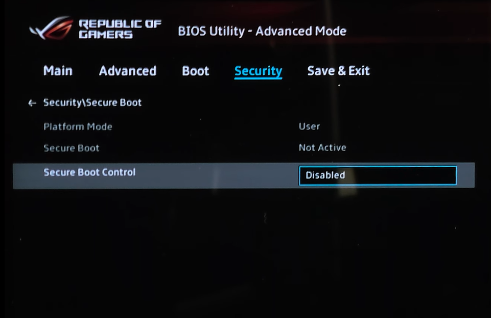
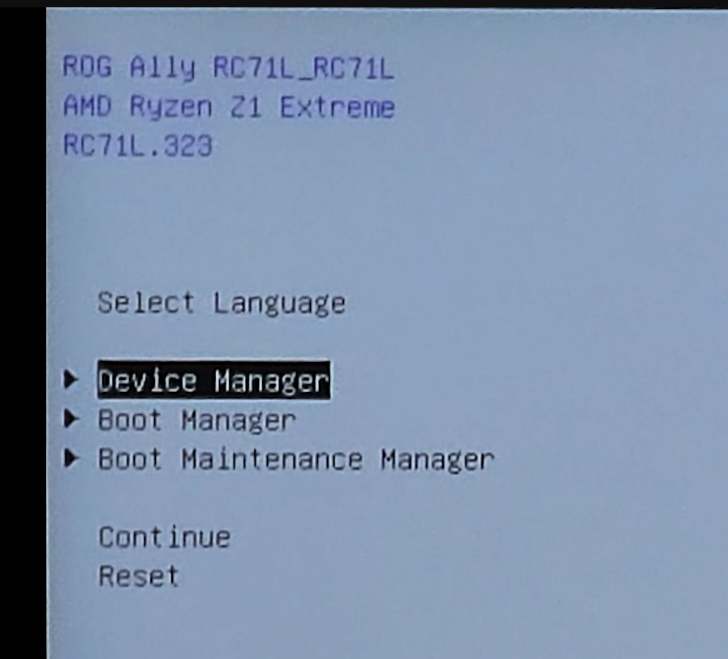
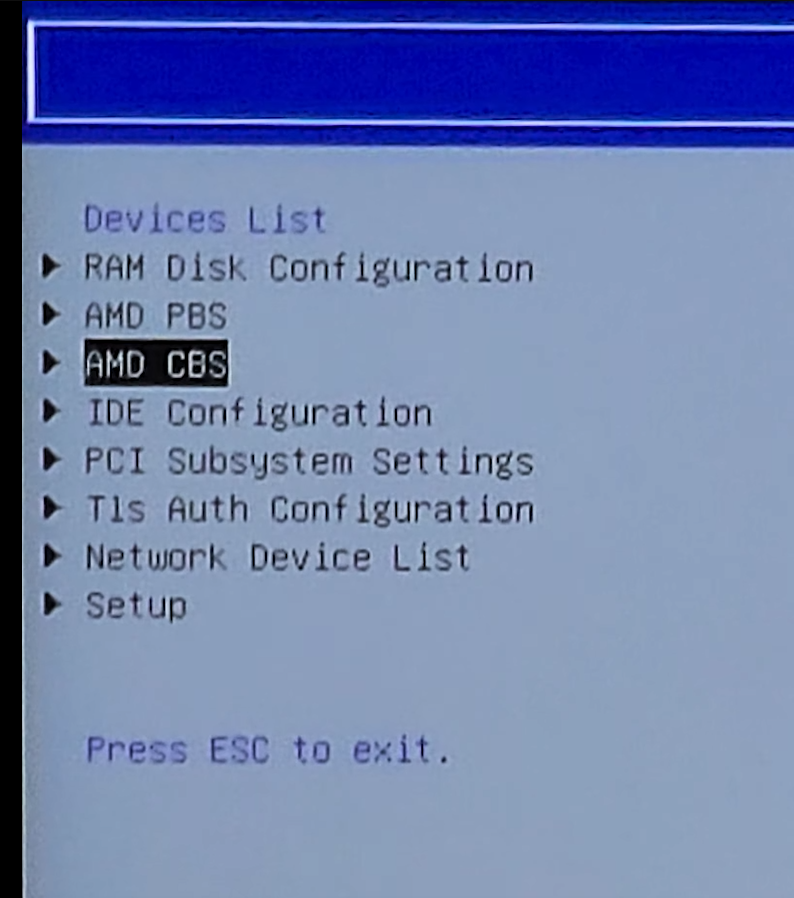
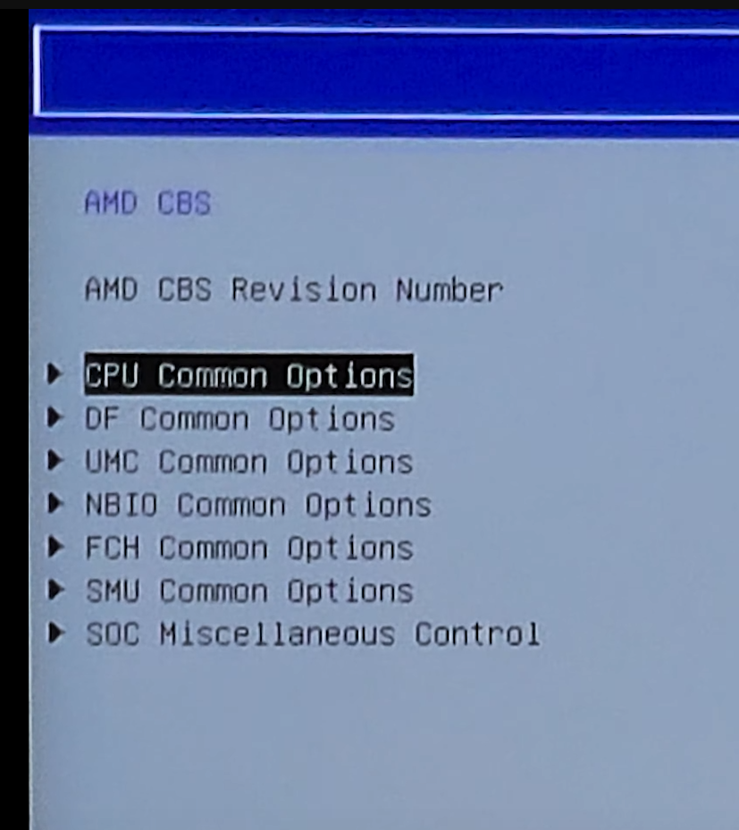
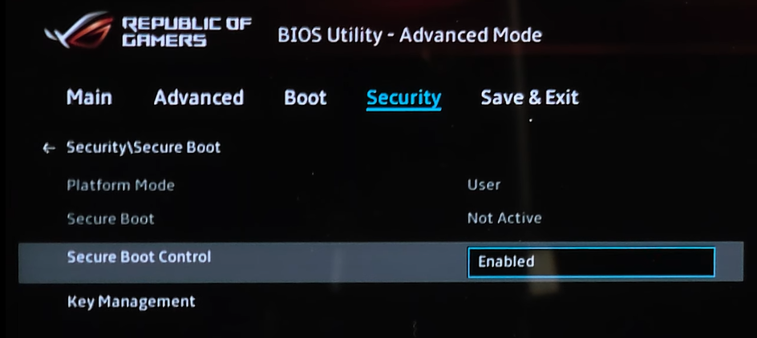
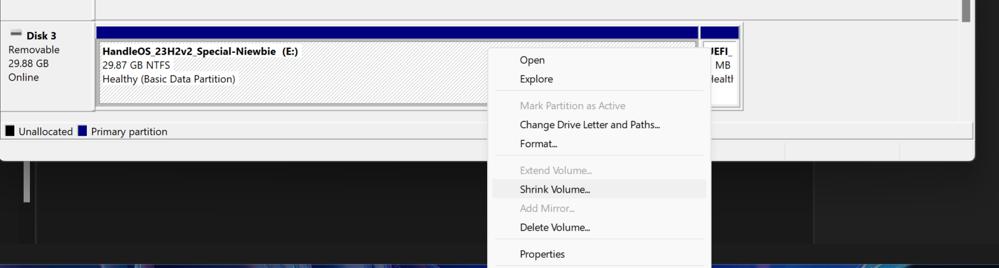
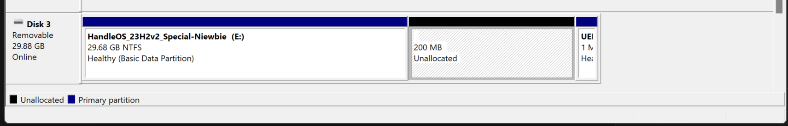
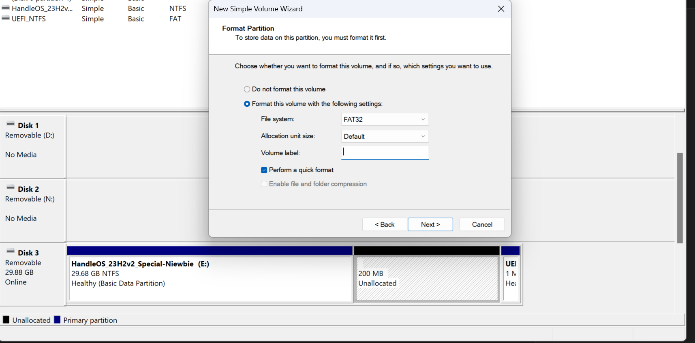
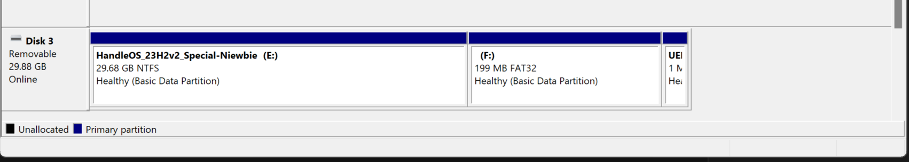

<a href="README.md" style="color: #2079C8;">Introduction</a> | <a href="installation_guide.md" style="color: #2079C8;">Download + Installation Guide</a> | <a href="features.md" style="color: #2079C8;">Features</a> | <a href="https://github.com/Special-Niewbie/HandleOS/discussions" style="color: #2079C8;">Discussions</a> | <a href="HybridvsConsole.md" style="color: #2079C8;">Hybrid Mode vs Console Mode</a>| <a href="BCDFix.md" style="color: #2079C8;">Guide to Restoring BCD</a> | <a href="TP.md" style="color: #2079C8;">Tweak Paradise</a> | <a href="PrivacyPolicy.md" style="color: #2079C8;">Policy Privacy</a>

# Installation Guide for HandleOS

Follow these steps to install **HandleOS** correctly on your device. Please make sure to follow each step carefully to ensure a smooth and proper installation process.

## Download the HandleOS ISO Creator Tool

Instead of downloading a pre-made ISO, you can create your own optimized *HandleOS* installation with our new official tool!

Download the `HandleOS ISO Creator`, and also, download the latest `Console2Desk` from the following link: [HandleOS ISO Creator + Console2Desk](https://github.com/Special-Niewbie/HandleOS/releases)

***Note:*** After creating your *HandleOS* installation, you may need to update your system and install your preferred browser (*yes, you must and you can Update your OS*). My recommendation is to use ***Firefox***, as it offers the best balance between performance and privacy but I added few other choices into `HandleOS ISO Creator`. I advise avoiding ***Edge*** due to its high background resource consumption. You can also download the tool called `Smokless_UMAF_Settings_HandleOS` to disable the *C-STATE* on some AMD architectures (*C-STATE procedure for some unsupported AMD devices like Rog ALLY (X) or Legion Go, you can find at the end of this page. Otherwise, disable it from your BIOS*).

## Using HandleOS ISO Creator

The `HandleOS ISO Creator` tool offers a comprehensive interface with an internal `F.A.Q` section to understand all its features. Here are the main steps to accomplish:

1. **Create Your Custom HandleOS ISO**:
   - Launch the `HandleOS ISO Creator` tool.
   - You'll see buttons for the different ***HandleOS*** versions you can prepare.
   - Select your preferred version, then use the dedicated button to load an official Microsoft ISO (either **English International** or **English** version (64 bit), ***the language you can change after installed the OS***).
   - **IMPORTANT**: *The program will verify that you're using a genuine Microsoft ISO before proceeding*.
   - **ABSOLUTELY NECESSARY**: You must have an official Microsoft Windows activation key to use *HandleOS* legitimately. For handheld devices, **Windows Home Edition** is usually included in the `BIOS` and will auto-activate, but in other cases, you must have an official key. Any illegal actions to bypass activation are strictly condemned and not supported.
   - Once verified, you can proceed with customization options for your *HandleOS* installation.
2. **Create Installation Media**:
   - The tool also allows you to prepare a bootable USB drive for installation.
   - Select your USB drive from the dropdown menu (be careful with the "**Unsafe List**" option which shows drives larger than `128GB`).
   - Choose between GPT (for modern computers) or MBR (for older ones) formatting options to ensure proper booting.
   - Enable the "**Add Folder**" switch if you want to prepare and include drivers and software in a "**MyApps**" folder on both the `ISO` and `USB`.
   - You can also choose where to save your ISO file with the "**Save ISO**" switch if you don't want save it in the same folder as the original Windows ISO uploaded.
   - Click "Start" to begin the process.

The program provides visual feedback through an animated Progress Circle and informational lines that show the current step in the *HandleOS* preparation process.

## Install HandleOS

1. **Installation**:

   - Make sure to unplug any other external USB drives and SD flash cards before proceeding with the installation process.
   - Boot from the USB drive prepared with the *HandleOS ISO Creator*.
   - Follow the installation prompts to install *HandleOS* on your internal SSD or hard drive. The installation process will guide you through the necessary steps.

2. **Initial Setup**:

   - After installation, you will start in `Console Mode`.

   - To switch to `Desktop Mode`, use the `Console2Desk` tool. Click the "Desktop" button to transition to `Desktop Mode`.

     Entering in `Desktop Mode` at the beginning is recommended for installing drivers and essential system software, as it provides the full Windows environment.

If you have any questions or need further assistance, feel free to reach out or check out the [HandleOS Discussions](https://github.com/Special-Niewbie/HandleOS/discussions) or better our **HandleOS** official  server.

**Please note:** From **Console2Desk 4.0.0** onwards, all future updates will be available exclusively to those who make a donation to the project. If you would like to test the software, all previous versions remain available in the version history on the GitHub Page.

  

  

## (Optional) Preparation for Smokless-UMAF (disable C-STATE for certain Handled/PC devices)

⚠️**IMPORTANT!!**  This tool, called `Smokless_UMAF_Settings_HandleOS`, provided in a zip file, is **ONLY for certain AMD APU architectures on Handheld/ PCs that do not have this option in their BIOS menu**, such as the `Asus Rog Ally`. **Before using it, ensure that your device is compatible with `Smokless_UMAF` , otherwise you risk bricking your BIOS.** If your device already has this voice option according to your BIOS vendor's guide, be sure to disable the same C-STATE Option, as it may limit HandleOS performance. Disabling this option will also prevent your device from entering any Sleep/Hibernation state, but HandleOS has a faster Turn ON/OFF process compared to the standard Windows setup.

Here it's the link to download *Smokless_UMAF_Settings_HandleOS*: [Download Smokless-UMAF](https://drive.google.com/drive/folders/17-bPnBSjUiEPouGeiwU6VQjYxb9h5uiE?usp=drive_link).

1. **Prepare a USB Drive**:

   - Format a USB drive to FAT32.
   - Extract the contents of the `Smokless_UMAF_Settings_HandleOS.zip` file to the USB drive (if you need, you can check the Open-Source project here: https://github.com/DavidS95/Smokeless_UMAF ).
   - That's it.

2. **Turn on your PC/Handled and temporary Disable Secure Boot**:

   - So, before starting Smokless-UMAF ( the extra BIOS menu settings), disable Secure Boot in your BIOS settings . This is necessary for the `Smokless-UMAF` tool to modify hidden BIOS functions (specific to AMD architectures).
   - Here the pic example reference: 

3. **Run Smokless-UMAF**:

   - Boot from the USB drive and run the `Smokless-UMAF` tool.

   - Follow the on-screen instructions to disable the *CPU C-State*. This setting helps improve performance and stability, particularly for handheld devices.

     Here are the picture references:

<table>   <tr>     <td style="text-align: center; vertical-align: middle; font-size: 20px;">        <strong>START Smokless-UMAF</strong>     </td>     <td align="center">       <strong>2. First Menu: Device Manager</strong>             </td>     <td align="center">       <strong>3. Second Menu: AMD CBS</strong>             </td>   </tr>   <tr>     <td align="center">       <strong>4. Third Menu: CPU Common Options</strong>             </td>     <td align="center">       <strong>5. Fourth Menu: Disable Global C-State Control and SAVE</strong>             </td>     <td align="center">       <strong>6. Reactivate Secure Boot</strong>             </td>   </tr> </table>

**NOTE:** Remember to save before going out from `Smokless-UMAF`, if you are not sure if you saved, check again and follow the same steps.

- **Important:** This procedure must be redone if you upgrade your BIOS version, because the new BIOS version will wipe the previous settings!

  

  

## (Optional) Prepare Double Boot single USB for HandleOS ISO Creator and Smokless

1. **A big thanks to Leo-Tamioky from the HandleOS Discord group, for the unique guide on how to create a Dual Boot USB with HandleOS and Smokless.** So, use this point `1`, if you have only one USB and you would like to consolidate the two below installations.

   The guide walks you through creating a dual-boot USB stick that consolidates all the data for HandleOS in one place.

   First, use the HandleOS ISO Creator to prepare your USB drive. Once it's created, right-click the Start icon and go to Disk Management; there you will find your newly created USB. Right-click on it and select Shrink Volume.

   In the third field (Specify the amount of space to shrink, in MB), enter an appropriate amount, with 100–200MB being sufficient, and then click Shrink.

   Afterward, a black partition will appear, which you will need to activate. Still in Disk Management, format this black partition in FAT32.

   By the end of the process, you will have your USB stick with an additional partition of 100/200MB that you just created. In this new partition, place the unzipped files from the Smokless ZIP package. Now, your single USB is ready with dual boot for HandleOS and Smokless.

   Thanks to Leo-Tamioky's testing, the two interfaces are seen separately, as if they were being launched from two different USB sticks.

   
         
 
         

# *Disclaimer*

*The HandleOS ISO Creator is designed to help you build your own optimized Windows installation while adhering to Microsoft's guidelines. The tool only applies modifications and optimizations to official Microsoft Windows installations that you download directly. It is essential that you use a legitimate Windows license for any HandleOS installation. This project does not support or condone any illegal methods of software activation.*

## Why Use HandleOS ISO Creator?

- **Personalized Yet Standardized:** Create your own HandleOS installation while ensuring compatibility with official support.
- **Error Prevention:** The guided process helps avoid issues caused by manual modifications.
- **Official Support:** By using the HandleOS ISO Creator, you'll have a configuration that can be properly supported through our official channels.
- **Legitimate Windows Installation:** You'll always be using an officially sourced Windows installation with HandleOS enhancements applied.

## *Important Security Reminder*

All my softwares are digitally signed by me. Please download only from my official channels that for now are only this **GitHub page**  and **HandleOS** official  server.
 Avoid external sites that may tamper with the software.
 **Please, stay safe, and help me spread this message!!!**
