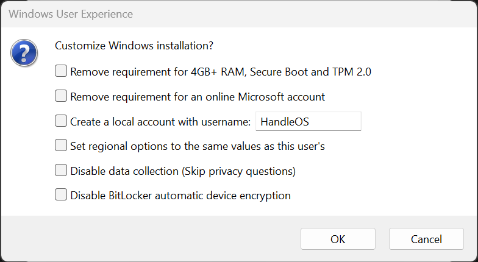

<a href="README.md" style="color: #2079C8;">Introduction</a> | <a href="installation_guide.md" style="color: #2079C8;">Download + Installation Guide</a> | <a href="features.md" style="color: #2079C8;">Features</a> | <a href="https://github.com/Special-Niewbie/HandleOS/discussions" style="color: #2079C8;">Discussions</a> | <a href="HybridvsConsole.md" style="color: #2079C8;">Hybrid Mode vs Console Mode</a>| <a href="BCDFix.md" style="color: #2079C8;">Guide to Restoring BCD</a> | <a href="TP.md" style="color: #2079C8;">Tweak Paradise</a> | <a href="PrivacyPolicy.md" style="color: #2079C8;">Policy Privacy</a>

# Installation Guide for HandleOS

Follow these steps to install HandleOS correctly, on your device. Please make sure to follow each step carefully to ensure a smooth and right installation process.

## Download the ISO

Download my borrowed ISO, and the necessary tool from the following link: [Download HandleOS ISO](https://drive.google.com/drive/folders/17-bPnBSjUiEPouGeiwU6VQjYxb9h5uiE?usp=drive_link).

And, download latest `Console2Desk` release here: [Console2Desk.exe Latest Release](https://github.com/Special-Niewbie/HandleOS/releases).

***Note:***  `HandleOS 23H2v3.1`, does not include any `23H2` updates—you need to update after installation—and does not include any browser. Please download your preferred browser beforehand. My recommendation is to use ***Firefox***, as it offers the best balance between performance and privacy. I advise avoiding ***Edge*** due to its high background resource consumption.  Also you can download the tool called `Smokless_UMAF_Settings_HandleOS` to disable the *C-STATE* on some AMD architectures (*C-STATE procedure for some unsupported AMD devices like Rog ALLY, you can find in the end of this page. Otherwise, disable it from your BIOS*)  . 

## Post-Installation

1. **Download ISO and Verify SHA256 Hash serial ISO Number**:
   
   - After downloading the ISO, check the SHA256 hash to ensure it matches the provided hash. This step is crucial for verifying the integrity of the downloaded HandleOS ISO file. You can find the file named `README_HandleOS_23H2v3.1_Genuine_Check_ISO.txt`. 
     If you don't have the .txt file, execute this command by your Windows Terminal/CMD:  
     `certutil -hashfile "HandleOS_23H2v3.1.iso" SHA256`
   
   - Here it's the serial SHA256 Hash ISO number:
   
     1. **HandleOS_23H2v3.1** genuine SHA256 = 
     
        <a href="" style="color: #2079C8;">e46e1cc3cac8267d336806f74e0a573d9a2cb0564b85bfb36db4b25bcf4a35f4</a>

###### Deprecated OLD Version:

`HandleOS_23H2v3_Home genuine SHA256 = c8734a698d82b635625690921d37cafbac37bc2aa7d8b5b88f71d77dfcf180f6`
***HandleOS_23H2v3_Home** is deprecated due to some stability issues and the Xbox app not working as expected.*

`HandleOS 23H2v2 genuine SHA256 = 634a06f5ad10e38c937f332f04ee371049f60be0b25139e0f52c15f2e06b5710`

## Install HandleOS

1. **Installation**:
   
   - If you are using software like Rufus to prepare the USB installation drive, make sure to **uncheck** any options related to Windows Debloat or similar features in such tools. This is important because HandleOS, already includes these optimizations within its system. Additionally, registry changes made by third-party software could potentially corrupt the HandleOS installation dataset. HandleOS is finely tuned and does not require additional debloating steps from these tools. So, be sure on Rufus (as example) it's set like the picture Below:
     
     
     
     
     

   - Make sure to unplug any other external USB drives and SD flash cards before proceeding with the installation process.
   - Boot from the HandleOS ISO.
   - Follow the installation prompts to install HandleOS on your SSD or hard drive. The installation process will guide you through the necessary steps.

1. **Initial Setup**:
   
   - After installation, you will start in `Console Mode`.
   - To switch to `Desktop Mode`, use the `Console2Desk` tool. Click the "Desktop" button to transition to `Desktop Mode`.
   
     Entering in `Desktop Mode` at the beginning, is recommended for installing drivers and essential system software, as it provides the full Windows environment.

If you have any questions or need further assistance, feel free to reach out or check out the [HandleOS Discussions](https://github.com/Special-Niewbie/HandleOS/discussions).

  

  

## (Optional) Preparation for Smokless-UMAF (disable C-STATE for certain Handled/PC devices)

⚠️**IMPORTANT!!**  This tool, called `Smokless_UMAF_Settings_HandleOS`, provided in a zip file, is **ONLY for certain AMD APU architectures on Handheld/ PCs that do not have this option in their BIOS menu**, such as the `Asus Rog Ally`. 
**Before using it, ensure that your device is compatible with `Smokless_UMAF` , otherwise you risk bricking your BIOS.** 
If your device already has this voice option according to your BIOS vendor's guide, be sure to disable the same C-STATE Option, as it may limit HandleOS performance. Disabling this option will also prevent your device from entering any Sleep/Hibernation state, but HandleOS has a faster Turn ON/OFF process compared to the standard Windows setup.

1. **Prepare a USB Drive**:

   - Format a USB drive to FAT32.
   - Extract the contents of the `Smokless_UMAF_Settings_HandleOS.zip` file to the USB drive (if you need, you can check the Open-Source project here: https://github.com/DavidS95/Smokeless_UMAF ).
   - That's it.

2. **Turn on your PC/Handled and temporary Disable Secure Boot**:

   - So, before starting Smokless-UMAF ( the extra BIOS menu settings), disable Secure Boot in your BIOS settings . This is necessary for the `Smokless-UMAF` tool to modify hidden BIOS functions (specific to AMD architectures).
   - Here the pic example reference:
     

3. **Run Smokless-UMAF**:

   - Boot from the USB drive and run the `Smokless-UMAF` tool.

   - Follow the on-screen instructions to disable the *CPU C-State*. This setting helps improve performance and stability, particularly for handheld devices.

     Here are the picture references:

<table>
  <tr>
    <td style="text-align: center; vertical-align: middle; font-size: 20px;">
       <strong>START Smokless-UMAF</strong>
    </td>
    <td align="center">
      <strong>2. First Menu: Device Manager</strong> 
      
    </td>
    <td align="center">
      <strong>3. Second Menu: AMD CBS</strong> 
      
    </td>
  </tr>
  <tr>
    <td align="center">
      <strong>4. Third Menu: CPU Common Options</strong> 
      
    </td>
    <td align="center">
      <strong>5. Fourth Menu: Disable Global C-State Control and SAVE</strong> 
      
    </td>
    <td align="center">
      <strong>6. Reactivate Secure Boot</strong> 
      
    </td>
  </tr>
</table>

**NOTE:** Remember to save before go out from `Smokless-UMAF`, if you are not sure if you saved , check again and follow the same steps.

- **Important:** This procedure must be redone if you upgrade your BIOS version, because the new BIOS version will wipe the previous settings!

  

  

## (Optional) Prepare Double Boot single USB to install HandleOS/ Smokless 

1. **A big thanks to Leo-Tamioky from the HandleOS Discord group, for the unique guide on how to create a Dual Boot USB with HandleOS and Smokless.**
   So, use this point `1`, if you have only one USB and you would like to consolidate the two below installations.

   The guide walks you through creating a dual-boot USB stick that consolidates all the data for HandleOS in one place.

   As the first step, use Rufus to create the USB with the ready image, following all the necessary steps. Once Rufus finishes creating the image, right-click the Start icon and go to Disk Management; there you will find your newly created USB named HandleOS_23H2v2_Special-Niewbie. Right-click on it and select Shrink Volume.

   In the third field (Specify the amount of space to shrink, in MB), you can enter an appropriate amount, with 100–200MB being sufficient, and then click Shrink.

   Afterward, a black partition will appear, which you will need to activate. Still in Disk Management, format this black partition in FAT32.

   By the end of the process, you will have your USB stick with an additional partition of 100/200MB that you just created. In this new partition, place the unzipped files from the Smokless ZIP package. Now, your single USB is ready with dual boot for HandleOS and Smokless.

   Thanks to Leo-Tamioky's testing, the two interfaces are seen separately, as if they were being launched from two different USB sticks.

   

       
       
   

   

       
       
   

# *Disclaimer*  

*The ISO provided here is for **educational purposes only** and is shared to help you understand how to configure the operating system in future steps. It is **not to be redistributed**, as the operating system belongs to Microsoft.*  

*To provide better support for this project and standardize the mods/ISOs of HandleOS, the next steps will involve creating a tool that allows you to prepare your own HandleOS ISO while adhering to Microsoft's guidelines.*  

## In near future we will have two Options for ISO Creation:  

### 1. ISO Created by You : 

You will download the ISO from Microsoft's official website and follow the few guidelines provided in the tool.  

- **Note:** Stability and performance will depend entirely on your configuration, so I cannot provide support for this option.  

### 2. In near future, my Tool:  

My tool will process the ISO you download from Official Microsoft site to create an **official HandleOS ISO**, which will be tested and optimized by me.  

### Why Use My Tool?  

- **Unified Version:** It ensures a unified HandleOS version, making support easier since everyone will have the same configuration.  
- **Error Prevention:** It avoids issues caused by user errors, unofficial scripts, or manual modifications that may lead to problems not present in the officially tested version by me.  
- **It avoid these inconsistencies made by users:** of how they set them OS with different level of experiences can cause errors and I cannot support or reproduce, creating confusion for the project's development that we no need.   

## *Important Security Reminder*  

All my software is digitally signed by me. Please download only from my official channels that for now are only this **GitHub page**  and **HandleOS** official  server.  
Avoid external sites that may tamper with the software.  
**Please, stay safe, and help me spread this message!!!**  
