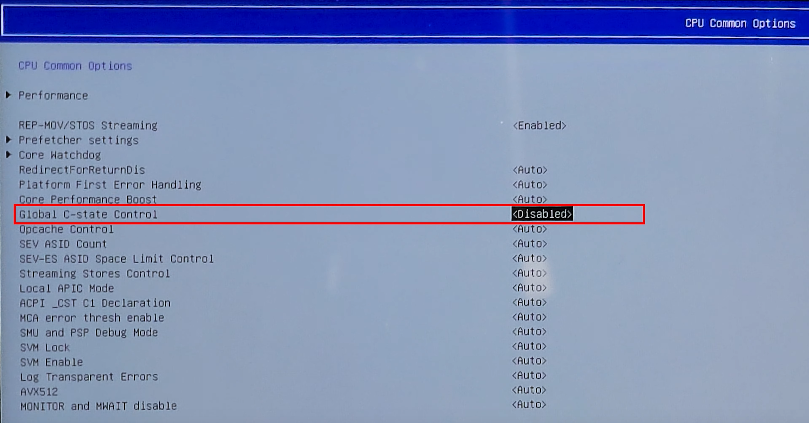

<a href="README.md" style="color: #2079C8;">Introduction</a> | <a href="installation_guide.md" style="color: #2079C8;">Download + Installation Guide</a> | <a href="features.md" style="color: #2079C8;">Features</a> | <a href="https://github.com/Special-Niewbie/HandleOS/discussions" style="color: #2079C8;">Discussions</a> | <a href="BugFix_and_NewFeatures.md" style="color: #2079C8;">Bug Fix & New Features Scheduling</a> | <a href="BCDFix.md" style="color: #2079C8;">Guide to Restoring BCD</a>

# Installation Guide for HandleOS

Follow these steps to install HandleOS correctly, on your device. Please make sure to follow each step carefully to ensure a smooth and right installation process.

## Download the ISO

You can download the `HandleOS ISO` along with the tool to disable the *C-STATE*. 

This tool, called `Smokless_UMAF_Settings_HandleOS` in a zip file, is **ONLY for AMD APU Architectures on handheld PCs that do not have this option in their BIOS menu**, such as the `Asus Rog Ally`. If your device already has this option according to your BIOS vendor's guide, be sure to disable the same C-STATE Option, otherwise it significantly limits HandleOS performance, and after that you can go directly to the ISO installation process (without using `Smokless_UMAF_Settings_HandleOS`).

Download my borrowed ISO, and the necessary tool from the following link: [Download HandleOS ISO](https://drive.google.com/drive/folders/17-bPnBSjUiEPouGeiwU6VQjYxb9h5uiE?usp=drive_link).

***Note:*** The second version of HandleOS, `23H2v2`, does not include any updates. This is because, like any new Microsoft update, it has some stability issues. 

## Post-Installation

1. **Verify SHA256 Hash serial ISO Number**:

   - After downloading the ISO, check the SHA256 hash to ensure it matches the provided hash. This step is crucial for verifying the integrity of the downloaded HandleOS ISO file. You can find the file named `README_HandleOS_23H2_Genuine_Check_ISO.txt`. 
     If you don't have the .txt file, execute this command by your Windows Termina:  
     `certutil -hashfile "HandleOS_23H2v2.iso" SHA256`

   - Here it's the serial SHA256 Hash ISO number:

     1. (Old Version- deprecated) HandleOS 23H2 genuine SHA256 = `1be41e42f21e899ba17f26685aee6e1f24a5afbcc00611685a6841588fb97de0`
   
     1. HandleOS 23H2v2 genuine SHA256 = `634a06f5ad10e38c937f332f04ee371049f60be0b25139e0f52c15f2e06b5710`
     
        

## Preparation for Smokless-UMAF (disable C-STATE for HandleOS)

1. **Prepare a USB Drive**:
   
   - Format a USB drive to FAT32.
   - Extract the contents of the `Smokless_UMAF_Settings_HandleOS.zip` file to the USB drive (if you need, you can check the Open-Source project here: https://github.com/DavidS95/Smokeless_UMAF ).
   - That's it.
   
2. **Turn on your PC/Handled and temporary Disable Secure Boot**:
   
   - So, before starting Smokless-UMAF ( the extra BIOS menu settings), disable Secure Boot in your BIOS settings . This is necessary for the `Smokless-UMAF` tool to modify hidden BIOS functions (specific to AMD architectures).
   - Here the pic example reference:
     
   
3. **Run Smokless-UMAF**:
   
   - Boot from the USB drive and run the `Smokless-UMAF` tool.
   
   - Follow the on-screen instructions to disable the *CPU C-State*. This setting helps improve performance and stability, particularly for handheld devices.
   
     Here are the picture references:
<table>
  <tr>
    <td style="text-align: center; vertical-align: middle; font-size: 20px;">
       <strong>START Smokless-UMAF</strong>
    </td>
    <td align="center">
      <strong>2. First Menu: Device Manager</strong> 
      
    </td>
    <td align="center">
      <strong>3. Second Menu: AMD CBS</strong> 
      
    </td>
  </tr>
  <tr>
    <td align="center">
      <strong>4. Third Menu: CPU Common Options</strong> 
      
    </td>
    <td align="center">
      <strong>5. Fourth Menu: Disable Global C-State Control and SAVE</strong> 
      
    </td>
    <td align="center">
      <strong>6. Reactivate Secure Boot</strong> 
      
    </td>
  </tr>
</table>

**NOTE:** Remember to save before go out from `Smokless-UMAF`, if you are not sure if you saved , check again and follow the same steps.

- **Important:** This procedure must be redone if you upgrade your BIOS version, because the new BIOS version will wipe the previous settings!

## Install HandleOS

1. **Installation**:
   
   - If you are using software like Rufus to prepare the USB installation drive, make sure to **uncheck** any options related to Windows Debloat or similar features in such tools. This is important because HandleOS, already includes these optimizations within its system. Additionally, registry changes made by third-party software could potentially corrupt the HandleOS installation dataset. HandleOS is finely tuned and does not require additional debloating steps from these tools. So, be sure on Rufus (as example) it's set like the picture Below:
     
     
     
     
     

   - Make sure to unplug any other external USB drives and SD flash cards before proceeding with the installation process.
   - Boot from the HandleOS ISO.
   - Follow the installation prompts to install HandleOS on your SSD or hard drive. The installation process will guide you through the necessary steps.

1. **Initial Setup**:
   
   - After installation, you will start in `Console Mode`.
   - To switch to `Desktop Mode`, use the `Console2Desk` tool. Click the "Desktop" button to transition to `Desktop Mode`.
   
     Entering in `Desktop Mode` at the beginning, is recommended for installing drivers and essential system software, as it provides the full Windows environment.

If you have any questions or need further assistance, feel free to reach out or check out the [HandleOS Discussions](https://github.com/Special-Niewbie/HandleOS/discussions).
