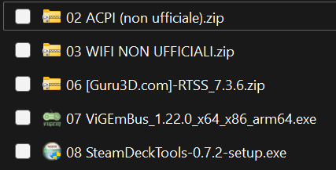

<a href="README.md" style="color: #2079C8;">Introduction</a> | <a href="installation_guide.md" style="color: #2079C8;">Download + Installation Guide (non Steam Deck Users)</a> | <a href="features.md" style="color: #2079C8;">Features</a> | <a href="https://github.com/Special-Niewbie/HandleOS/discussions" style="color: #2079C8;">Discussions</a> | <a href="HybridvsConsole.md" style="color: #2079C8;">Hybrid Mode vs Console Mode</a>| <a href="BCDFix.md" style="color: #2079C8;">Guide to Restoring BCD</a> | <a href="TP.md" style="color: #2079C8;">Tweak Paradise</a>


(Guide by @AllevatoreAnonimo)

## Required Hardware

- 1 USB flash drive (must be empty, at least USB 2.0)
- 1 Keyboard
- 1 Mouse
- 1 Docking station with video output
- 1 (Optional) Monitor (to don't watch in Portrait/Vertical the screen)
- 1 Steam Deck + Power Adapter
- 1 (Optional) External HDD/SSD for backing up the disk image (ensure there's enough space for the image)
- 1 Additional PC to prepare the necessary files
- 1 USB Hub 3.0 (if your dock doesn't have at least 4 USB ports: for mouse, keyboard, USB flash drive, and SSD/HDD)
- Knowledge of the difference between LEFT SHIFT (left-side shift key) and CAPS LOCK
- Knowledge of the difference between MBR and GPT

## Required Software

- [HandleOS](https://drive.google.com/drive/folders/17-bPnBSjUiEPouGeiwU6VQjYxb9h5uiE)

- Pre-Download your preferred Browser (don't suggest you to install `Microsoft Edge`), because `HandleOS` it's completely clean.

- [Ventoy](https://www.ventoy.net/en/download.html) (or [Rufus](https://rufus.ie/en/))

- [Clonezilla AMD64 ISO](https://clonezilla.org/downloads.php)

- [GParted AMD64 ISO](https://gparted.org/download.php)

- [Official Steam Deck Drivers (excluding APU and WIFI)](https://help.steampowered.com/en/faqs/view/6121-ECCD-D643-BAA8)

- [Unofficial AMD PVN-SoC APU Drivers 23.11.1*](https://rdn-id.com/#download)

- [Catalyst v5.5_23.30 (this specific version)](https://sourceforge.net/projects/radeon-id-distribution/files/Dependencies/V5.5/ccc2_install_v5.5_23.30.exe/download)

- [Unofficial WiFi Driver](https://github.com/ryanrudolfoba/SteamDeck-Windows-WiFi-Fix/archive/refs/heads/main.zip)

- [Clover-dualboot for Steam Deck](https://github.com/ryanrudolfoba/SteamDeck-Clover-dualboot/archive/refs/heads/main.zip)

- [DDU - Display Driver Uninstaller](https://www.guru3d.com/download/display-driver-uninstaller-download/)

- [Missing ACPI Drivers](https://h30434.www3.hp.com/psg/attachments/psg/Hardware/341445/1/AMD%20ASD%20WB64A.zip)

  

  `List of Official Drivers` (all listed below drivers are from @AllevatoreAnonimo)

  <div style="display: flex; justify-content: left; align-items: left;">
      

  `List of non-Official Drivers`

  <div style="display: flex; justify-content: left; align-items: left;">
      
  </div>

  `List of Other Drivers`

  <div style="display: flex; justify-content: left; align-items: left;">
      
  </div>

  **PS:** *If you are not sure and you cannot find all the drivers listed by @AllevatoreAnonimo, please come in our HandleOS Discord Server, to ask the help (the Discord Server invitation, it's on the main page).*

## Preparing the Ventoy USB Drive

1. Once everything is downloaded, connect the USB flash drive to your PC.
2. Open Ventoy, go to `Language` in the top menu, and select your language.
3. Go to `Options`, make sure `Secure Boot` is checked.
4. Under `Options`, scroll to `Partition Table Style` and select `GPT`.
5. Still in `Options`, click on `Partition Configuration`.
6. Check the box for `exFAT`. In the `Cluster Size` dropdown menu, select `System Default`.
7. Do not check `Reserve some space [...]`.
8. Check the box for `Align partitions to 4KB`.
9. Click `OK`.
10. In the `Device` dropdown menu, select your USB flash drive. If it doesn’t appear, press the button with the two circular arrows to refresh the list. If it still doesn't appear, the USB drive might not have an assigned letter—format it as a standard USB drive and try again.
11. Once the USB drive is formatted, copy the 3 ISO files you previously downloaded (`Clonezilla`, `GParted`, and `HandleOS`) onto the drive.
12. Safely eject the USB drive to prevent corruption of the ISO files when unplugging it.


## Steam Deck Preparation

1. With the Steam Deck **OFF** (not in standby), hold down `VOL+` and `Power`, and the BIOS will appear.
2. Scroll using the `D-PAD` to `Setup Utility`, then press `A`.
3. Scroll down using the `D-PAD` to `Advanced`, press `Right` to enter the list.
4. Scroll down to `UMA Frame Buffer Size`, then press `A`.
5. Scroll down to `4G`, then press `A`.
6. Press the `Left` button to go back and scroll down to `Exit`, then press `Right`.
7. Select `Exit Saving Changes` and press `A`.
8. Now **turn off** the console after SteamOS boots as usual.

## Backup of Steam Deck Disk Image

Before proceeding, ensure you have enough space on the target disk:
- If the Steam Deck's SSD is 256GB, you will need at least 256GB of free space on the target disk.
- For a 512GB SSD, ensure the destination disk has space for 512GB, and so on.

1. Connect the docking station with the monitor, Steam Deck, keyboard, mouse, and prepared Ventoy USB stick. **Do not connect the SSD/HDD** where the Steam Deck backup will be stored.
2. Also, connect the power adapter to the dock to ensure proper power delivery. The adapter must supply at least 60W.
3. With the Steam Deck **OFF** (not in standby), hold down `VOL-` and `Power`, and the boot menu will appear.
4. If everything is connected properly, the image should appear on the monitor instead of the Steam Deck.
5. Select the prepared USB stick with Ventoy and press `Enter`.
6. Select the Clonezilla ISO to boot.
7. Choose `Boot in normal mode`.
8. Clonezilla’s menu will appear. Select the first option `Clonezilla Live (VGA 800x600)` and press `Enter`.
9. Scroll to `it_IT.UTF-8 Italian | Italiano`, then press `Enter` to confirm. (From here on, press `Enter` to confirm selections.)
10. Select `Keep` to skip keyboard configuration.
11. Choose `Start_Clonezilla`.
12. Select `Device-Image`.
13. Select `Local_dev`.
14. Now connect the HDD/SSD where the backup will be stored to the dock or USB HUB, then press `Enter`.
15. You should see the list of inserted disks. If not, disconnect and reconnect the device and wait for detection.
16. Once everything is detected, press `CTRL+C`.
17. Clonezilla will now scan for both readable and writable partitions.
18. After this process, select the **destination disk** where the Steam Deck disk image will be copied.
19. Carefully select the correct destination disk using the `UP` and `DOWN` arrows, then press `Enter`.
20. Select whether you want to verify the disk or not.
21. Select the destination folder if one was created earlier, or scroll directly to `Done`.
22. Review everything and press `Enter` to confirm.
23. After scanning the destination disk, choose `Beginner`.
24. Then select `Savedisk`.
25. Type a name for the backup or leave the default, then press `Enter`.
26. Now select the Steam Deck **SOURCE** SSD using the `Space Bar`. It is usually labeled `nvme0n1`. Press `Enter`.
27. Choose a compression method; I recommend the first multicore option.
28. Choose whether you want to check the file system before starting.
29. Select if you want to verify the saved image afterward.
30. If you don’t have top-secret information on your Deck, do not encrypt the image.
31. Choose what to do when the copying process finishes; I suggest selecting `-p choose`.
32. Ignore everything and press `Enter` to confirm all settings.
33. The backup process should now start. Check if everything is correct, press `y`, then `Enter`.
34. Go do something else, as this will take a while.
35. The process cannot be canceled, so if you are in a hurry, you must wait.
36. Once done, check the result of the copy and press `Enter`.
37. Select `Poweroff` to shut down the system.
38. Wait for the shutdown, then connect the external destination disk to your PC to verify that the backup files are present.


## Resizing the Partition to Make Space for HandleOS

Before starting, make sure you have enough space before resizing the partition. If you don't have sufficient space, you won't be able to install HandleOS at the end of the disk. It's recommended to free up at least 128GB to install some games, and anything extra is a bonus!

1. Turn on the Steam Deck by holding down `VOL-` + `Power`, and the boot menu will reappear.
2. Select the USB drive where Ventoy is installed.
3. Scroll to the GParted ISO and press `Enter`.
4. Select `Boot in Normal Mode`.
5. In the menu that appears, select `GParted Live (default settings)`.
6. On the next screen, select `Don't touch keymap`.
7. Example: Type `14` for the Italian layout or `33` for the USA layout.
8. Press `0` to immediately launch the graphical interface.
9. Once the graphical interface starts, the GParted program will appear.
10. Maximize the window by clicking the dark gray square in the top right corner.
11. Right below the top right square, there is a dropdown menu. Select the device `/dev/nvme0n1`.
12. Once the disk space allocation graph appears, right-click on the largest partition.
13. Select `Resize/Move`.
14. In the graph, drag from the right to the left to reduce the partition size. Adjust the size using the `Free space following` field.

Note: The space is measured in megabytes, so if you want 512GB, for example, calculate it as approximately 512000 megabytes.

15. Once you're done, click `Resize/Move`.
16. The changes are not yet applied. To confirm them, click the green checkmark (`V`) at the top.
17. It should only take a few seconds.
18. Close the window by clicking the black square in the top right corner.
19. Double-click on `EXIT`.
20. Select `Shutdown` and then `OK`.

:information_source:**IMPORTANT!!!** *If SteamOS boots up after this, it will try to reassign the extra disk space. If it accidentally starts, let the resizing process finish and repeat the procedure. **DO NOT TURN IT OFF** until SteamOS has fully started, otherwise, you risk corrupting SteamOS and will need to reinstall it!*


## Installing HandleOS

1. Turn on the Steam Deck by holding down `VOL-` + `Power`, and the boot menu will reappear.
2. Select the HandleOS ISO.
3. Select `Boot in normal mode`.
4. Once the screen appears, select the appropriate format and keyboard layout, then click `Next`.
5. Accept the terms and conditions, then click `Next`.
6. Scroll to the bottom of the partition list and select `Drive 0 Unallocated Space`, then click `Next`.
7. Wait for the installation to complete. It should restart automatically.
8. On the first login, it will prompt for a C2D update—ignore this and launch the pre-installed Playnite.
9. In the menu, select `Console2Desk` by pressing `A` twice.
10. Using the mouse, click `Yes` on the security screen.
11. In the C2D (Console2Desktop) screen, select `Desktop`.
12. Close all open programs.
13. Go to `Start` and type `UAC` in the search field.
14. Click on `Change User Account Control settings`.
15. Move the slider down to the bottom, then click `OK` and `Yes`.

## Removing Buggy Microsoft APU Drivers

1. Remove the USB stick with the ISO from the Docking Station and connect it to a support PC.
2. Copy all the remaining software you previously downloaded (various drivers and tools) onto the USB stick.
3. Once copied, safely remove the USB stick and reconnect it to the Dock.
4. Create a folder called `Utility` on the desktop of the C: drive and copy the software you just transferred into it.
5. Extract the .7z file and run the installation file for DDU.
6. Right-click on an empty space on the desktop and select `Safe Mode` → `Restart in Safe Mode`.
7. Once Safe Mode is launched, ignore any error messages and go to the folder where you extracted DDU.
8. Launch Display Driver Uninstaller, click `OK` on the warning, and leave the default options by pressing `Close`.
9. In the dropdown menu `Select device type`, select `GPU`.
10. If `AMD` doesn’t appear automatically in the dropdown below, select it manually.
11. Click `Clean and do NOT Restart`.
12. Wait for the cleaning process to finish.
13. Once complete, right-click on an empty space on the desktop and select `Safe Mode` → `Restart in Normal Mode`.


## Installing Modified APU Drivers

1. Extract the modified APU driver file `WHQL-AMD-Software-Hybrid-Edition-23.11.1-PVN-AMDSoC-Nebula-Native-DCH` into a subfolder.
2. Run the file `SetupCLI.exe`.
3. Select `1` for `Steam Deck / VanGogh`, then press `Enter`.
4. Use the `ARROW KEYS` to scroll to `SDI`, then press `Enter`.
5. On the left column, click `Select all`, then click `Install`.
6. If it asks for confirmation to install, proceed with the installation.
7. The screen may appear rotated or have large pillars on the sides—this is normal.
8. Continue waiting for the driver installation to complete.
9. The screen might return to the default Deck orientation in Portrait mode—**THIS IS NORMAL**. This indicates the installation was successful.
10. Click on the flashing SDI button.
11. Now, right-click on the background and select `Display Settings`.
12. Enlarge the window and change the desktop orientation from `Portrait` to `Landscape`, then click `Keep Changes`.
13. On the Deck's screen, return to the installation menu (make sure you didn’t accidentally close it). If SDI is still open, close it only.
14. In `SetupCLI`, select `AMD Default`.
15. Then select `Long`.
16. Next, select `Adrenalin`.
17. Use the arrow keys to select `Standard`.
18. Then select `RdNID Mode - Standard`.
19. Now select `Factory RdNID`.
20. Flashing text will appear—this is normal.
21. Select `Yes` to install the Catalyst software.
22. Select `1`.
23. A folder `c:\AMD` will be created. Copy the file `ccc2_install_v5.5_23.30.exe` into that folder.
24. Select `MANUAL`.
25. Confirm that the file has been copied after the download. Ignore any window pop-ups.
26. Once completed, close the Catalyst Installer window to return to SetupCLI.
27. Press `X` to exit the installation.
28. Restart your device.
29. After restarting, the image should reappear on the main screen.
30. Reset the display orientation to `Landscape` as before.
31. Press the keyboard shortcut `WIN+P` to select only the external display.

## Disabling Driver Signature Enforcement

1. Restart the Steam Deck while holding the `Left Shift` key. If successful, a `Please Wait...` message will appear.
2. Select `Troubleshoot`.
3. Select `Start-up Settings`.
4. Press `Restart`.
5. Press the `F7` button to disable driver signature enforcement.


## Installation of Modded Wi-Fi Drivers

1. Go back to the `Utility` folder and extract the file named `SteamDeck-Windows-WiFi-Fix-main.zip`.
2. Now, right-click on `Start` and select `Device Manager`.
3. Ignore other missing devices; they will be fixed later in this guide.
4. Under the `Network Adapters` section, double-click on `Realtek 8022CE [...]`.
5. Go to the `Driver` tab and click `Update Driver`.
6. Select `Browse my computer for drivers`.
7. Choose `Let me pick [...]`.
8. Click on `Have Disk`.
9. Navigate to the `Driver` folder of the previously extracted files.
10. `RTK Killer Wi-Fi 5 8822CE Xtreme [...]` should appear in the list. Select it and click `Next`.
11. In the red warning screen, force the installation by clicking `Install this driver software anyway`.
12. Click `Close` and restart your device.

## Installation of Audio Drivers

1. Follow the installation procedure for the official drivers. Right-click on the `.inf` file and install it in both folders.

## Installation of Bluetooth Drivers

1. Follow the installation procedure for the official drivers.

⚠️**WARNING!!** *THE INSTALLATION SCRIPT HAS A BUG; INSTALL FROM A PATH WITHOUT SPACES!!*

## Installation of MicroSD Drivers

1. Follow the installation procedure for the official drivers.
2. Restart the Steam Deck.

## Installation of Missing Drivers

1. Connect to the internet and perform Windows updates; some missing drivers are provided by Microsoft. Repeat the updates until everything is up to date.
2. Three drivers called `Unknown device` will remain to be installed; these are the ACPI drivers never officially released.
3. Extract the file `AMD ASD WB64A.zip`.
4. Click on each device and force the installation of the drivers for each one by selecting the extracted driver, similar to the Wi-Fi card.
5. Restart the computer.

## BONUS TRACK: Possible Missing Driver

It may happen that one of the missing drivers is neither detected nor installed by Windows updates: the `AMD PSP 10.0 Device`. You can find it separately on the HandleOS GitHub.

⚠️**WARNING!!** 
*After the Windows update, audio drivers may stop working. Remove audio devices and reinstall them.*

## Installation of Dual Boot Management Program

1. From an admin CMD, run the following commands:

```
bcdedit.exe -set {globalsettings} highestmode on
reg add "HKEY_LOCAL_MACHINE\System\CurrentControlSet\Control\TimeZoneInformation" /v RealTimeIsUniversal /d 1 /t REG_DWORD /f
```
The first command sets the correct screen setting at startup, and the second sets the system clock to UTC like in Linux.

2. Power off the console and hold `VOL-` + `Power`.
3. Select `SteamOS`.
4. Once booted, go to desktop mode and set a root password if you haven't done so already.
5. Open the console and run the following command:

```
git clone https://github.com/ryanrudolfoba/SteamDeck-Clover-dualboot
```
6. If an error occurs, it means you had previously installed Cloverboot. Delete the old folder with:

```
rm -rf ~/SteamDeck-Clover-dualboot
```
7. Then redownload the updated repo:

```
git clone https://github.com/ryanrudolfoba/SteamDeck-Clover-dualboot
```
8. Launch the installation:

```
cd ~/SteamDeck-Clover-dualboot
chmod +x install-Clover.sh
./install-Clover.sh
```
9. Follow the on-screen instructions; in case of problems, rerun the installation script or consult the official GitHub.


## Installation of Various Useful Libraries for Game Installation

1. Download and install the Visual C++ libraries, both x86 and x64 versions.

   *Link:* [Visual C++ Redistributables](https://github.com/abbodi1406/vcredist/releases)

2. Download and install DirectX (do not install the Bing toolbar when prompted; installation time may vary depending on the MicroSD used and internet speed):

   *Link:* [DirectX End-User Runtime Web Installer](https://www.microsoft.com/en-us/download/details.aspx?id=35)

3. Download and install the .NET 6.0 Desktop Runtime:

   *Link:* [.NET 6.0 Desktop Runtime](https://download.visualstudio.microsoft.com/download/pr/513d13b7-b456-45af-828b-b7b7981ff462/edf44a743b78f8b54a2cec97ce888346/windowsdesktop-runtime-6.0.15-win-x64.exe)

## (Optional) Remove Password Prompt When Exiting Sleep Mode

- Open CMD with administrative privileges and disable the password prompt when exiting sleep mode:


```
PowerCfg /SETACVALUEINDEX SCHEME_CURRENT SUB_NONE CONSOLELOCK 0
PowerCfg /SETDCVALUEINDEX SCHEME_CURRENT SUB_NONE CONSOLELOCK 0
```

**NOTE:** To benefit from this option, it is absolutely necessary to keep the `Fast Startup` option enabled under the advanced power saving features.

## (Optional) Replace On-Screen Keyboard with a Better Version

- Replace the default OSK with the Touch version:

*Link:* [Replace OSK](https://github.com/Lulech23/ReplaceOSK)

## Optimizations Dedicated to Steam Deck

1. Download and install the ViGembus Gamepad drivers:

*Link:* [ViGembus Driver](https://ds4-windows.com/download/vigembus-driver/)

2. Download and install RTSS (Rivatuner):

*Link:* [Rivatuner Statistics Server](https://www.guru3d.com/download/rtss-rivatuner-statistics-server-download/)

3. Download and install Steam Deck Tools in Setup version:

*Link:* [Steam Deck Tools](https://github.com/ayufan/steam-deck-tools/releases/latest)

⚠️**WARNING!!** *If the Steam Deck is used for online gaming, it is advised not to alter the fan speed values and governors, as anti-cheat software may detect this as tampering, resulting in a ban.*

## Installation of Steam Client

At this point, you can finally install the Steam Client:

*Link:* [Steam Client](https://store.steampowered.com/about/)
